---

id: monstertix
summary: An agent that waits in a queue, survives being killed, and buys tickets at 3am inside limits you set. ADK 2 on Google Cloud.
categories: Cloud, AiAndMachineLearning
authors: Christina Lin
Feedback Link: https://github.com/google/monstertix


---


# Everything You Need to Build Long-Running Agents on Google Cloud

## Before you begin

Most ticketing sites put buyers in a queue, both to prevent server crashes and to manage high demand. You start your purchase and find yourself behind 14,000 people. The queue moves for forty minutes. When your turn finally comes, you have a short window to pick seats and pay. If you miss that window, your place in line is given away.

Many real-world tasks follow this pattern: **a task that takes far longer than a single conversation, running against an external system you do not control.** Examples include waiting for a supplier to restock, waiting for a claim approval, or waiting in a queue.

Standard AI agents live inside a single chat turn, which lasts seconds and is purely reactive. They cannot wait 40 minutes or act autonomously. To solve this, you need a **long-running agent**: a system that stays dormant during long waits, persists context across process restarts, and resumes automatically when woken by an external trigger.

This workshop walks you through building a concert ticket queue agent, covering the core architectural patterns required for long-running agents on Google Cloud.

<aside class="negative">
<b>⚠️ ETHICAL DISCLAIMER:<br/> Ticket bots are a real problem and real ticketing sites prohibit automation.</b> This workshop runs against a <b>mock venue service</b>, buying <b>one</b> allotment for <b>yourself</b>, inside limits you set.
</aside>

### What you'll build

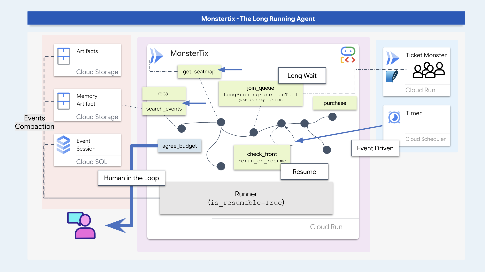

In this workshop, you will build a long-running ticket booking agent while learning key agentic software patterns:

- **Process Suspension & Resumption**: Park an agent invocation during long wait periods and resume execution via external triggers.
- **Durable State Storage**: Persist conversation state and artifacts across process restarts using SQLite/Cloud SQL and Cloud Storage.
- **Staleness Guards & Idempotency**: Verify dynamic data (like seat availability) before acting and use idempotency keys to prevent duplicate transactions.
- **ADK Workflow Graphs**: Structure execution using deterministic code nodes for procedural rules and agent nodes for contextual decision-making.
- **Human-in-the-Loop Approval**: Pause execution to collect and persist explicit spending limits from the user.
- **Cloud Deployment**: Containerize and deploy the agent to Cloud Run with Cloud Scheduler and Pub/Sub triggers.


### Get set up

First, get your environment ready and make sure you have access to Google Cloud. I recommend running this in Cloud Shell, which already has every tool you need. Just check you have enough space, and that your account can create projects.

👉💻 Clone the repo and run setup:

```bash
cd ~
git clone https://github.com/gca-americas/monstertix
cd ~/monstertix
./setup.sh
```

It will ask you this once:

```
  Which Google Cloud project should this workshop use?
  Find yours at https://console.cloud.google.com  (top-left picker)

  Project id [YOUR_PROJECT_ID]:
```

Then it does the following, in order:

| | |
|---|---|
| **virtualenv** | creates `.venv` and installs ADK 2 into it |
| **sign-in** | `gcloud auth application-default login` if you have no credentials yet |
| **project** | points `gcloud` at your project and sets it as the quota project |
| **APIs** | enables the ten the workshop needs. `aiplatform`, `run`, `cloudbuild`, `artifactregistry`, `storage`, `pubsub`, `cloudscheduler`, `cloudtrace`, `logging` and `sqladmin`. |
| **`.env`** | writes your project, region and model id, so every script and `adk web` picks them up |
| **model check** | makes one real call to Gemini, so a bad project or model id fails here |
| **seed** | builds a session that is already two days old, which step 3 opens |
| **Cloud SQL** | starts a Postgres instance **in the background** |
| **venue** | deploys your own mock ticket seller to Cloud Run |

A script does all of that so everyone in the room ends up on the same rig. At
work you would not write it, you would describe it:

<aside class="positive">
<b>⌨️ Reference Prompt</b> You would not hand-write a setup script at work. You would describe it:
<pre>Set up a Python project for building agents with Google ADK 2 on Google Cloud.

Write a single setup.sh that does all of this, in order, and is safe to run
any number of times:

  1. check Python is 3.11 or newer, and stop with a clear message if not
  2. create a .venv and install google-adk, or reuse one that exists
  3. prompt ONCE for a Google Cloud project id, validate it with
     `gcloud projects describe`, and remember it in ~/project_id.txt so a
     re-clone or a shell timeout does not ask again
  4. run `gcloud auth application-default login` ONLY if there are no
     credentials already
  5. enable these APIs, skipping any already enabled:
     aiplatform, run, cloudbuild, artifactregistry, storage, pubsub,
     cloudscheduler, cloudtrace, logging, sqladmin
  6. write a .env with the project, region and model id

Rules:
  - never use an API key. Vertex AI with Application Default Credentials only
  - every step checks before it acts, so re-running repairs rather than
    duplicates
  - do not use ${VAR:-default} for values I want pinned; a stale export in my
    shell must not win over the value the script sets</pre>
</aside>

👉💻 Activate the environment:

```bash
cd ~/monstertix
source .venv/bin/activate
```

Your prompt now starts with `(.venv)`.

<aside class="negative">
<b>⚠️ A new terminal tab starts deactivated.</b> If you ever see <code>adk: command not found</code>, run <code>source .venv/bin/activate</code> again in that tab.
</aside>


<aside class="negative">
<b>⚠️ Give the venue a minute.</b> Cloud Run starts it from cold, so the first load can look like a dead link. Wait, reload, and it'll be there.
</aside>

### Scenario Overview

In this workshop scenario, your agent books two tickets for a concert ("The Midnight Signal" in Amsterdam). The user's preferences stored in historical memory include:
- Must be a weekend show (Sam cannot attend weeknights).
- Avoid upper bowl seating at Ziggo Dome (poor visibility).
- Target price is approximately $200 per ticket, with a $250 max limit.


### Verify your installation

👉💻 One command, eight ticks:

```bash
./verify.sh
```

```
  Checking the rig

  ✓ adk installed                      adk, version 2.6.2
  ✓ adk 2 apis                         App + ResumabilityConfig
  ✓ workflow graphs                    Workflow + node
  ✓ async sqlite drivers               sqlalchemy + aiosqlite + greenlet
  ✓ project                            your-project-id
  ✓ vertex ai                          no API keys anywhere
  ✓ seeded session                     13 events, two days old
  ✓ venue                              https://venue-you-xxxx.us-central1.run.app

  Ready. Cloud SQL is still building in the background and nothing
  before step 10 needs it.
```


👉 Open **second browser tabs**:

| Where | What it is |
|---|---|
| **`$VENUE_URL/panel`** | The control panel, your buttons. `setup.sh` printed this URL and put it in `.env` |


## Prompt your way to autonomy?

### Prompts Can't Start Themselves

A prompt is just text passed to an AI model when a call happens. It can't run on its own, wake itself up, or start a new call.

If you tell an agent in its prompt to "check back in 10 minutes," nothing actually happens after the current turn ends. The model has no internal clock or loop. To make an agent autonomous, something outside the agent has to wake it up and call it.

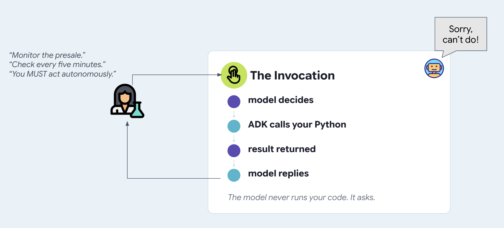

### Start the rig

We'll start by testing the developer tooling. **`adk web`** starts the **ADK web UI**, the development interface that ships with ADK. It lets you talk to the agent you are building without writing a frontend first, and it shows you what a chat window cannot show, such as every tool call and its arguments, the session state as it changes, the artifacts the agent saved, and the raw events underneath. You would not expose it in production. It is the best window into a running agent while you are learning. In step 3 you build the frontend you would actually expose, and in the final step you deploy it.

👉🔴 On the **venue panel**, press **RESET THE VENUE**. Every step starts from
the same world: 8 shows, all seats available, clock at 1×.

👉💻 **Terminal 1** — load this step's code and start the **ADK web UI**:

```bash
cd ~/monstertix
. ./set_env.sh
./use-solution.sh 2 --force
adk web agent --port 8000 --allow_origins "*"
```

`use-solution.sh` copies a step's finished code into `agent/`, which is where you work. Every step starts with it and it prints which files it changed so you know what to read.


<aside class="negative">
<b>⚠️ When running use-solution.sh. Stop <code>adk web</code> first.</b> Deleting <code>sessions.db</code> while it is open does not produce an error, the running process just keeps writing to a file that no longer has a name, and the next thing that looks strange costs you an hour. <code>use-solution.sh</code> checks port 8000 and refuses rather than let that happen.
</aside>

What you start with:

| File | What it is |
|---|---|
| `agent.py` | the agent — a name, a model, an instruction, a list of tools |
| `tools.py` | `search_events` and `get_seatmap` |
| `venue.py` | an HTTP client for the venue. Nothing interesting |
| `config.py` | which model to use, and a check that your credentials work |

`. ./set_env.sh` activates the virtualenv, loads your project and model, and exports `$WORKSHOP` — the absolute path to `~/monstertix`. Run it in **every** terminal you open. It prints what it set:

```
  folder   /home/you/monstertix
  project  your project id
  model    gemini-2.5-flash (We'll avoid using 3.x for now to avoid high usage demands)
  venue    https://venue-yourname-xxxx.run.app
```

👉 Open **first browser tabs**:

| Where | What it is |
|---|---|
| **ADK web UI** | `localhost:8000` — your agent, plus its State / Events / Artifacts tabs |


### Talk to it

👉✨ In the **ADK web UI**, type:

```
I want to see The Midnight Signal. I'm in Amsterdam, going with Sam, budget around $200 each.
```

It searches the tour, reads seat maps, and reasons about your budget and your company. This is a genuinely capable assistant.
However, when the presale opens at 10:00, the agent does not execute automatically because no process or background trigger is running.

### Read what just happened

The middle of the screen is not only a chat log. Every step of the turn is numbered, tool calls included:

```
  ▸ I want to see The Midnight Signal. I'm in Amsterdam...   ← user input
  ⚡ search_events({"city": "Amsterdam"})                     ← tool execution
  ✓ search_events                                            ← venue API response
    Two Amsterdam shows: Tuesday 10 Nov and Saturday 14 ...   ← model response
```

👉 Click a **⚡** row. The left panel shows the arguments the model picked. Click the **✓** underneath it for the JSON that came back.

The tour information is not present in the model's training data or prompt. The agent retrieved this data by executing the `search_events` tool, which queried the venue API.


### Open the code you just ran

You have seen it work and seen the trace. Now look at the code itself.

```
agent/concert/
├── agent.py     the agent — about twenty lines
├── tools.py     what it can do
├── venue.py     an httpx wrapper, nothing interesting
└── config.py    which model, and a credentials check
```

👉💻 Open `agent/concert/agent.py`. The whole agent is the bottom of the file:

```python
INSTRUCTION = """
You help someone plan a trip to see a band on tour.

You can search tour dates and read seat maps. Be concrete: name the show, the
city, the section, and the price...
"""

root_agent = Agent(
    name="concert",
    model=MODEL,
    instruction=INSTRUCTION,
    tools=[search_events, get_seatmap],
)
```

A name, a model, some description of how agent should behave, and a list of Python functions. That is all an `Agent` is. `adk web` found it because the file is called `agent.py` and the variable is called `root_agent`.

👉💻 Now `agent/concert/tools.py`:

```python
def search_events(city: str = "", weekday: str = "") -> dict:
    """List tour dates. Call with no arguments to see the whole tour.

    This venue sells one artist and one tour, so there is nothing to search by
    name — never ask the user which artist they mean.

    Args:
        city: Optional. Filter to one city, e.g. "Amsterdam".
        weekday: Optional. Filter to one weekday, e.g. "Saturday".
    """
    return venue.get("/events", city=city, weekday=weekday)
```

An ordinary function. No decorator, no registration, no schema to write. ADK reads the signature and the docstring and builds the tool definition the model sees, which is why that docstring is load-bearing, and why deleting one argument changed the model's behaviour.

**The model never runs your code.** When you saw `search_events({"city": "Amsterdam"})`, the model was *asking* for that call. ADK ran the function, handed the result back, and the model wrote a sentence about it. The loop is:


👉 The icons down the far-left edge switch what the panel shows. The second one is the **agent graph** — try it and you should see two tools.:

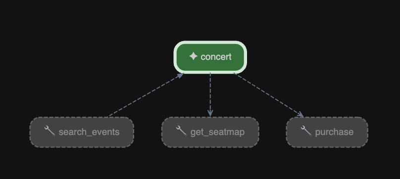


<aside class="positive">
<b>⌨️ Reference Prompt</b> The whole agent, described rather than typed:
<pre>Write a Google ADK 2 agent package called `concert`, as four small files.

agent.py
  root_agent = Agent(name, model, instruction, tools=[...])
  The instruction is plain prose. Tell it to be concrete: name the show, the
  city, the section and the price, and keep answers to two or three sentences.

tools.py
  Two plain Python functions, no decorators and no registration:
    search_events(city: str = "", weekday: str = "") -> dict
    get_seatmap(event_id: str) -> dict
  Each needs a docstring with an Args: section describing EVERY argument.
  ADK builds the tool schema the model sees from the signature and the
  docstring, so a missing description is a missing part of the API.

venue.py
  A thin httpx wrapper around a base URL from a VENUE_URL env var.
  Return errors as data — {"error": True, "message": ...} — never raise. A
  tool that raises hands the model a stack trace; a tool that returns an
  error hands it something it can explain to a person.

config.py
  Read the model id from ADK_MODEL. Fail loudly at import if Vertex
  credentials are missing, saying exactly what to set.</pre>
<b>Check by hand:</b> the <b>docstrings</b>. They are not comments here, they are the tool schema. And check that <code>venue.py</code> returns errors rather than raising: that is the difference between an agent that recovers and a run that dies.
</aside>

---

### So tell it not to sleep

What would you do to fix it? Try the thing most people reach for first. Recall `INSTRUCTION` from step 1, the prose handed to the model on every turn, and rewrite it.

👉💻 Open `agent/concert/agent.py`. Below `INSTRUCTION` there is a second one, already written for you. Try changing it yourself if you like:

```python
PROACTIVE_INSTRUCTION = """
You are a proactive ticket-buying assistant.

Monitor the presale for The Midnight Signal. The moment it opens at 10:00 on
Tuesday, buy two tickets for the Amsterdam Saturday show — do not wait to be
asked, and do not wait for me to say anything. Act on your own.

Keep checking until the tickets are bought.
"""
```
```python
# agent/concert/agent.py
root_agent = Agent(
    name="concert",
    model=MODEL,
    instruction=PROACTIVE_INSTRUCTION,     # ← was INSTRUCTION
    tools=[search_events, get_seatmap],
)
```

👉💻 In **terminal 1**, restart:

```bash
cd ~/monstertix
adk web agent --port 8000 --allow_origins "*"
```

👉✨ Tell it the plan, exactly as you would tell a person:

```
I want to see The Midnight Signal in Amsterdam with Sam. The presale opens at 10:00 on Tuesday. Grab us two tickets the moment it opens.
```

It will agree, and it will sound like it means it.

👉 Now wait. Do not type anything else. Watch the panel.

Give it a minute. **NOTHING HAPPENS!**

### Why that prompt was never going to work

Read it again with fresh eyes. *Monitor.* *The moment it opens.* *Keep checking.* Every one of those describes something happening **over time**.

Now recall what `instruction=` actually is. It is a string, handed to the model as part of the request, **at the moment somebody sends a message**. Nothing reads it in between turns.

```python
# agent/concert/agent.py
root_agent = Agent(
    instruction=PROACTIVE_INSTRUCTION,   # read on invocation
    ...                                  # ...and there was no invocation
)
```

An instruction cannot invoke the function it is written inside.


### Prompt Variations That Fail

Attempting to enforce autonomous execution via prompt instructions fails regardless of wording. Common prompt attempts—such as:

- *"Set a timer for 10:00 Tuesday and buy the tickets then."*
- *"Check every five minutes whether the presale has opened."*
- *"Act autonomously without waiting for user input."*

All fail for the same reason: prompts are read only when an invocation occurs. Without an external caller, no code is executed between turns.

<aside class="positive">
<b>👀 Developer's Note: Prompting Limitations.</b> Prompts cannot schedule future execution. Even if a model responds that it will monitor a queue or run later, no active process or background timer is created.
</aside>

---

## Event-Driven Dormancy

### Agents Don't Stay Awake Forever

Leaving a process running polling continuously wastes memory, burns money, and crashes if your laptop sleeps or restarts.

Instead of keeping an agent running non-stop while it waits, a long-running agent should go completely dormant. An external event (such as a timer, a webhook, or a message) wakes the agent up only when there is actual work to do.

👉🔴 On the **venue panel**, press **RESET THE VENUE**. Every step starts from
the same world: 8 shows, all seats available, clock at 1×.

👉💻 Load this step's code:

```bash
cd ~/monstertix
. ./set_env.sh
./use-solution.sh 3 --force
```

Notice what that installed: `monstertix/`, holding the server, the clock, and one more thing you have not seen yet. Check that it left `agent/` alone, because
nothing about the agent changes in this step. Hold onto that, it is the point.

| File | What it is |
|---|---|
| `monstertix/server.py` | new. A web server with a Runner behind it |
| `monstertix/clock.py` | new. Something that knows the time and calls the server |

It has two halves, and they stay in two files all the way to the cloud:
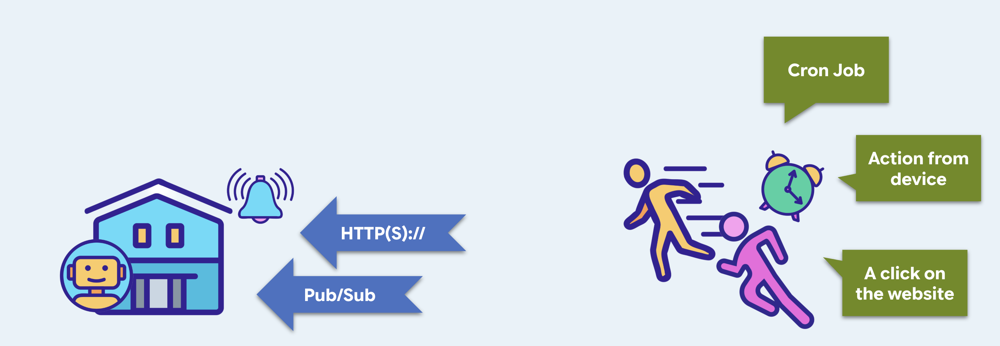

| | | becomes, in step 10 |
|---|---|---|
| **the trigger** | an endpoint that can run the agent | Cloud Run |
| **the triggerer** | something with a clock, that calls it | Cloud Scheduler |


### The trigger — your own web server

Yes, a web server. Something has to be *listening* before anything can call it. The **ADK web UI** from the previous steps is a development interface that happens to be able to run an agent.

👉💻 Open `monstertix/server.py`:

```python
from google.adk.runners import Runner
from google.adk.sessions import InMemorySessionService
from concert.agent import root_agent

session_service = InMemorySessionService()
runner = Runner(
    agent=root_agent,
    app_name="concert",
    session_service=session_service,
)

@app.post("/wake")
async def wake(payload: dict = Body(default={})):
    session_id = f"wake-{uuid.uuid4().hex[:8]}"          # brand new, every time
    await session_service.create_session(...)

    async for event in runner.run_async(
        user_id=USER_ID, session_id=session_id,
        new_message=types.Content(role="user",
                                  parts=[types.Part(text=payload["message"])]),
    ):
        ...
```

An `Agent` does not run itself. It is a description: a name, a model, an instruction, a list of tools. Something has to take an incoming message, find the right session, hand the model the conversation so far, execute whichever tools it asks for, feed the results back, loop until it stops calling tools, and write every step of that to storage. That something is the `Runner`.

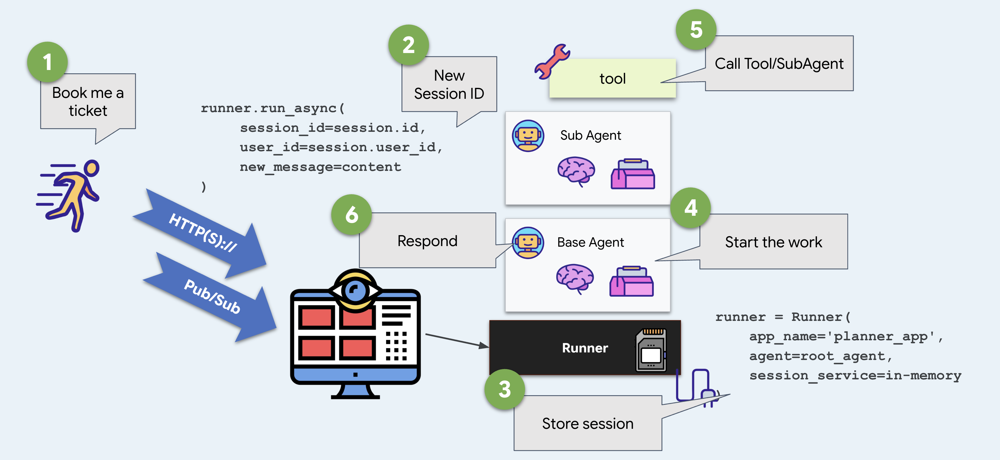

The **ADK web UI** has a default one for you. Here you build it yourself, and that is the entire difference between the **ADK web UI** and something you can deploy. 

👉💻 **Terminal 2** — start it:

Start the Runner, 

```bash
cd ~/monstertix
. ./set_env.sh
python -m monstertix.server
```

```
[server] agent concert · gemini-x-flash
[server] listening on http://xxxx_URL/wake
[server] nothing will happen until something calls it. Ctrl-C to stop.
```

Read that last line. The trigger is running and the agent is loaded, and nothing is happening. Separate the two ideas: being callable and being called.

---

### And a front door, while we are here

Despite `adk web` is a great development tool, it should not be something you ship. You should not enable it when deploying to production, and you would not point a customer at it if it did.
So the same server also serves a page.

👉 Open **http://127.0.0.1:8090** in a browser — the same address.

**Meet MonsterTix.** A chat window, a name in the corner, two buttons. It posts to `/wake` and renders what comes back, and it would work unchanged against any endpoint that answers the same way.

| On the page | What it is underneath |
|---|---|
| the conversation | `POST /wake`, one message at a time |
| **+ New session** | a fresh session id — new conversation, and later, a new budget |
| **Reset memory** | deletes every session and the memory file. It asks first, and shows you exactly where that state lives |


👉✨ Say something to it — `What Amsterdam dates are there?` — and watch **terminal 2**. Same `Runner`, same agent, same log lines. Only the caller changed.

<aside class="positive">
<b>👀 Developer's Note — </b> From here to step 10 you will mostly use <code>adk web</code>, because seeing inside a run is what you are here to learn. But in step 10 the agent moves to Cloud Run and <code>adk web</code> stays within your developer laptop. This page is what deploys next to the agent as one service. 
</aside>


<aside class="positive">
<b>⌨️ Reference Prompt</b> The half that listens:
<pre>Write a FastAPI server that exposes an ADK 2 agent over HTTP.

Startup, once:
  - build ONE Runner with my agent, an app name, and a session service backed
    by SQLite at a path from an env var
  - build the memory and artifact services the same way
  - log which agent, which session store and which memory store, so I can see
    what this process is actually wired to

Routes:
  POST /wake         {"message": ..., "session_id": ...}
                     create the session if it does not exist, run the agent,
                     return every text part it produced as a list
  POST /session/new  return a fresh session id
  GET  /             serve a static index.html

Also:
  - log every tool call on one line as it happens, so I can watch it work
  - the Runner must be reused across requests, never rebuilt per request

Keep it in one file, and keep anything that knows about the clock out of it.</pre>
<b>Check by hand:</b> that the <code>Runner</code> is built <b>once at startup</b>. A Runner built inside the handler gets a fresh session service every call, which looks fine until the agent needs to remember something from a minute ago.
</aside>

### The triggerer — something that knows the time

👉💻 Open `monstertix/clock.py`. Look at the code.

```python
time.sleep(args.delay)                                    # wait
while True:
    client.post(f"{TRIGGER_URL}/wake",                    # knock
                json={"message": args.message})
    if not args.every:
        return                                            # once, unless told otherwise
    time.sleep(args.every)                                # or again, forever
```

It is a very simple mechanism: sleep, POST, maybe repeat. Every scheduler you have used does the same, plus retries, timezones, and a guarantee that it survives a restart.

<aside class="positive">
<b>👀 Developer's Note: Local Scheduler Stand-in.</b> `clock.py` is a temporary local script. In production (Step 10), Cloud Scheduler replaces this script to provide managed, persistent execution triggers with automated retries.
</aside>

<aside class="positive">
<b>⌨️ Reference Prompt</b> And the half that knows the time:
<pre>Write a small Python CLI that POSTs {"message": ...} to a configurable URL
on a schedule.

Flags:
  --in SECONDS      fire once, after a delay
  --every SECONDS   fire repeatedly, forever
  --message TEXT    what to send

Behaviour:
  - read the target from a TRIGGER_URL env var
  - log each fire on one line, with the target and the time
  - handle Ctrl-C cleanly, without a traceback
  - if the target is down, log it and carry on. Do not crash, and do not retry
    in a tight loop

Dependencies: standard library plus httpx. No agent framework at all.</pre>
<b>Check by hand:</b> what the prompt does <b>not</b> mention: agents, ADK, sessions, the venue. If your description of the triggerer has to explain what an agent is, the two halves are not properly separated, and the half you throw away in the cloud will take the other half with it.
</aside>


👉💻 **Terminal 3** — fire once, 10 seconds from now:

```bash
cd ~/monstertix
. ./set_env.sh
python -m monstertix.clock --in 10
```

```
[clock] target   http://127.0.0.1:8090/wake
[clock] first fire in 60s, once only
[clock] go and watch the other terminal — do not touch the keyboard
```

👉 **Now stop typing.** Hands down. Watch terminal 2.

A minute later, with nobody at the keyboard:

```
[clock]  firing → POST /wake
[server] woken · session wake-23930983
[server]   called search_events
[server]   called purchase
[server]   said   I've purchased 2 tickets for The Midnight Signal in
                  Amsterdam on Saturday, section A. Your total is 420.
[clock]  done. the agent ran and you were not involved.
```

That is the answer to step 2. Something outside the agent called it, and that something was a `sleep` and an HTTP request.

👉💻 `Ctrl-C` both when you have watched it a couple of times. Use `--every 30` first if you want to see it repeat.

---

### Now read what it said

*"I've bought two tickets for The Midnight Signal in Amsterdam, section A, $420."*

👉🔴 Check the **venue panel** and you should see the ticket's been bought. 

<aside class="negative">
<b>⚠️ More than one order on the panel?</b> That is expected, and it is worth noticing rather than tidying away. Every fire of <code>clock.py</code> is a fresh wake with no memory of the last one, so if you ran it a few times, the agent bought a few times. Nothing stopped it, because nothing knew it had already happened. <b>Step 7 is where you fix that</b>, with an idempotency key the venue recognises.
</aside>

### So what is still wrong

It bought *something*. Look at what it had to guess. It picked Amsterdam and section A because they were the first thing it found, and you told the agent to buy it directly and it has no idea that Sam cannot do weeknights. **An agent that acts on guesses at 3am is worse than one that does nothing**.

<aside class="positive">
<b>👀 Developer's Note — this is not an alarm clock yet.</b> You started both halves by hand and they die with your terminals. They are stand-ins. In step 10 <code>clock.py</code> is <b>deleted</b> and Cloud Scheduler does its job, and <code>server.py</code> becomes <code>main.py</code> — the same routes on top of <code>get_fast_api_app(trigger_sources=["pubsub"])</code>, in one Cloud Run container with the page. Nothing on the agent side changes, which is exactly why the two halves are separate files.
</aside>

<aside class="positive">
<b>👀 Developer's Note — you now know three surfaces.</b> <code>adk web</code> for the rest of the workshop, because the State tab and the event stream are worth having while you learn. A bare <code>Runner</code> behind your own endpoint, for when nobody is watching. And in step 10, the same Runner behind ADK's Pub/Sub trigger endpoint. All three run the identical agent.
</aside>


> **Waking up is the easy half. An agent that wakes with nothing — no history, no
> preferences, nobody listening — is not yet worth waking.**

---

## Managing Context Lifetime

### Information Lives in Different Places for Different Times

An agent stores facts in several places: in the chat conversation, in session state, in files (artifacts), or in long-term user memory. Each place lasts for a different amount of time.

If you put information in the wrong place:
- **It disappears too soon**: Important details get wiped out when the chat ends.
- **It sticks around too long**: Temporary facts contaminate long-term memory and confuse future conversations.

You need to match each piece of information to the right storage place and lifetime.

### Load the code

👉🔴 On the **venue panel**, press **RESET THE VENUE**. 


👉💻 In the **terminal 1**, run:
```bash
cd ~/monstertix
. ./set_env.sh
./use-solution.sh 4 --force
```

What changed since the last step:

| File | What changed |
|---|---|
| `tools.py` | added `note_companion`. `get_seatmap` now saves the seat map to a file |
| `memory.py` | new. Our own memory store |
| `agent.py` | three more tools in the list, and the instruction tells the agent to use them |

👉💻 Restart the agent in **terminal 1**:

```bash
cd ~/monstertix
. ./set_env.sh
adk web agent --port 8000 --allow_origins "*" \
  --session_service_uri="sqlite+aiosqlite:///$WORKSHOP/sessions.db" \
  --artifact_service_uri="file://$WORKSHOP/artifacts"
```

Two flags you have not used before:

| Flag | What it is |
|---|---|
| `session_service_uri` | ADK writes every message, tool call and state change into it as rows (SQLite database.) |
| `artifact_service_uri` | Files the agent saves to.(Files) |

Without them, ADK keeps everything in memory and throws it away when you stop the process. These two settings are what make it persist.

The database `sessions.db` contains a seeded past conversation (`two-days-ago`) with 13 recorded events:

```
you    We're thinking about seeing The Midnight Signal. Me, Sam, and maybe Priya.
you    Sam can't do weeknights though, bailed on every single one.
you    Priya's out, she's away that weekend. Just me and Sam.
agent  Two it is. Still Saturday the 14th, still Amsterdam.
you    You said the upper bowl at Ziggo was bad last time?
```

**A memory file from three past bookings**, `memory/userx.md`, which you can open
in an editor:

```
- Sam bails on weeknights. Every weeknight show we booked, Sam cancelled.
- Hates the upper bowl at Ziggo Dome, "couldn't see a thing" from section B.
- Comfortable spend is around $200 per ticket. $250 is the hard ceiling.
- Always books two seats, always together.
```

**That is why the amber weeknight rows matter.** A weeknight show is $10 a seat cheaper, has better seats left, and sits at the top of the list, and it is the wrong answer for this person. The only reason the agent can know that is a file it wrote after the last booking. Whether that fact survives is steps 4 and 5.


### The three tools we added

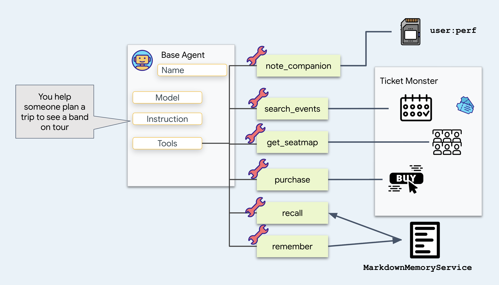

**`note_companion`** records who is coming and what limits them:

```python
# agent/concert/tools.py
def note_companion(name: str, constraint: str, tool_context: ToolContext) -> dict:
    prefs = dict(tool_context.state.get("user:prefs", {}))
    prefs[name] = constraint
    tool_context.state["user:prefs"] = prefs
    return {"companions": prefs}
```

Add it because "Sam can't do weeknights" has to still be true next week. Write it into `user:prefs` to make that happen, and watch the `user:` part of the name do the work. Come back to that below.

**`recall` and `remember`** read and write a text file, `memory/userx.md`. Hold those for a moment.


👉 Now look at the two places agent store it's context:

| location | What it holds |
|---|---|
| **State** | this session's memory, as key/value pairs — you live here in step 4 |
| **Artifacts** | files the agent saved, which never enter the prompt |

**Look at what changed in `get_seatmap`.** It used to return the whole seat map. Now it saves the seat map to a file and returns a short summary:

```python
# agent/concert/tools.py
async def get_seatmap(event_id: str, tool_context: ToolContext) -> dict:
    seatmap = venue.get(f"/events/{event_id}/seatmap")       # about 6 KB of JSON

    part = types.Part(inline_data=types.Blob(
        mime_type="application/json",
        data=json.dumps(seatmap, indent=2).encode()))
    await tool_context.save_artifact(f"seatmap_{event_id}.json", part)

    summary = {"event_id": ..., "sections": [...], "captured_at": ...}
    tool_context.state["temp:seatmap"] = summary
    return summary
```

Here is why that change matters.

Every tool return payload is appended to the conversation history and re-sent to the model on all subsequent turns. Returning large JSON objects (such as a 6 KB seat map) increases token consumption on every subsequent turn.

Save it to a file instead and pay one filename. Let the agent ask for the detail back with `load_artifact` if it needs it, and expect that most of the time it never will.

---

### Where the file goes: the artifact service

Look at the line in `get_seatmap` again, in `agent/concert/tools.py`:

```python
await tool_context.save_artifact(f"seatmap_{event_id}.json", part)
```

`tool_context` comes from ADK, which passes it into your tool as an argument, and `save_artifact` is a method on it. That line is where your tool hands the bytes to ADK.

ADK then writes them, using whichever **artifact service** it was started with. You picked that with the flag:

```bash
--artifact_service_uri="file://$WORKSHOP/artifacts"
```

ADK has three locations to store them:

| URI | Where the bytes go |
|---|---|
| `memory://` | RAM. Gone when you stop the process. This is the default if you pass no flag |
| `file://…` | a folder on disk. What you are using now |
| `gs://bucket` | Cloud Storage. What the deployed agent uses in the last step |

👉💻 Here we chooise files:

```bash
ls -R ~/monstertix/artifacts
```

To move from your laptop to Cloud Storage, change `file://` to `gs://`. (We'll see this in Step 10)

---

### Our memory store

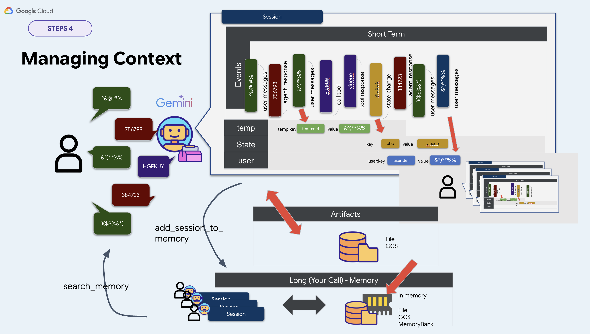

ADK gives you an interface for long-term memory called `BaseMemoryService`. It has two methods:

```python
# google.adk.memory.BaseMemoryService — ADK's interface, not your file
async def add_session_to_memory(session)                   # take a conversation in
async def search_memory(*, app_name, user_id, query)       # hand memories back
```

ADK ships three implementations of it:

| Class | URI | What it needs |
|---|---|---|
| `InMemoryMemoryService` | `memory://` | nothing. Loses everything when you stop the process |
| `VertexAiRagMemoryService` | `rag://` | a Vertex AI RAG corpus |
| `VertexAiMemoryBankService` | `agentengine://` | an Agent Engine resource |

We write our own for this workshop. Rule out `InMemoryMemoryService`, which forgets everything when you stop the process, and rule out the other two, which need cloud resources that take minutes to create. Pick a file instead, because you can seed it in advance and read it in an editor. So take `memory.py` as your own implementation, we're storing everything in a Markdown file:

```python
class MarkdownMemoryService(BaseMemoryService):

    async def search_memory(self, *, app_name, user_id, query) -> SearchMemoryResponse:
        path = self._path(user_id)                      # memory/userx.md
        return SearchMemoryResponse(memories=[
            MemoryEntry(content=types.Content(
                role="user", parts=[types.Part(text=path.read_text())]))])
```

`SearchMemoryResponse` and `MemoryEntry` are ADK's types, and Memory Bank returns the same objects. One has a managed service behind it. Ours has a file.

Choose a file for one reason: you can open it and read it. Your agent's entire long-term memory is a page of text.

### So where do you point it?

To recap in this workshop implemention, two of the three services are chosen on the command line. The third we did our own implementation for the reason above:

| Service | Where you set it | This workshop |
|---|---|---|
| session | `--session_service_uri` on `adk web` | `sqlite+aiosqlite:///$WORKSHOP/sessions.db` |
| artifact | `--artifact_service_uri` on `adk web` | `file://$WORKSHOP/artifacts` |
| **memory** | **nowhere on the command line** | `MEMORY_DIR`, read inside `agent/concert/memory.py` |


So `memory.py` constructs the service itself, from an env var:

```python
# agent/concert/memory.py
MEMORY_DIR = pathlib.Path(os.environ.get("MEMORY_DIR", "./memory"))
MEMORY_USER = os.environ.get("MEMORY_USER", "userx")
memory_service = MarkdownMemoryService(MEMORY_DIR)
```

`. ./set_env.sh` exports both. Get `MEMORY_DIR` sets where the agent reads it's memeory from and `MEMORY_USER` determines the file. 

<aside class="negative">
<b>⚠️ <code>MEMORY_USER</code> is not the session's user id, and that is deliberate.</b> <code>adk web</code> hardcodes <code>userId=user</code> and cannot be told otherwise, while your own server and the deployed service use something else. Key the file off the session and the memory file changes name depending on which surface you are on: your laptop writes <code>user.md</code> and Cloud Run reads something different. One fixed name is what lets a single memory file work across all three.
</aside>

<aside class="negative">
<b>⚠️ We call this service from a tool, which is not where it belongs.</b> A memory service belongs on the Runner, and ADK then uses it for you:
<pre>Runner(agent=root_agent, app_name="concert",
       session_service=...,
       memory_service=MarkdownMemoryService("./memory"))</pre> That is what <code>monstertix/server.py</code> does. But <code>adk web</code> builds its services at startup from a URI, before it loads any of your code, so it cannot be handed an object. For the rest of this workshop the <code>recall</code> and <code>remember</code> tools call the service directly.
</aside>

---

### Go and find where things are

You now have four places that can hold a fact. Look at all four.

### First, your own session

👉 Click **New Session** in the top bar.

👉✨ Say three things, one after the other:

```
Sam can't do weeknights, by the way.
```

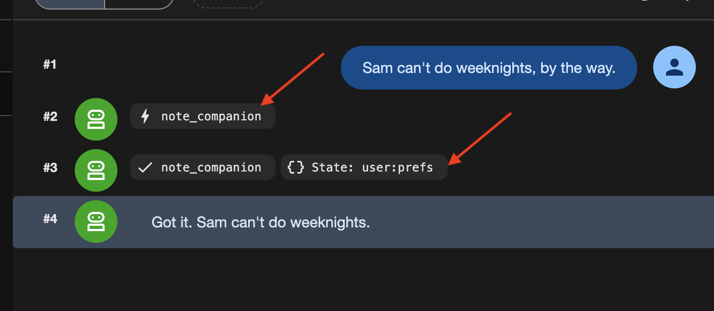

```
Show me the seat map for the Amsterdam Saturday show.
```

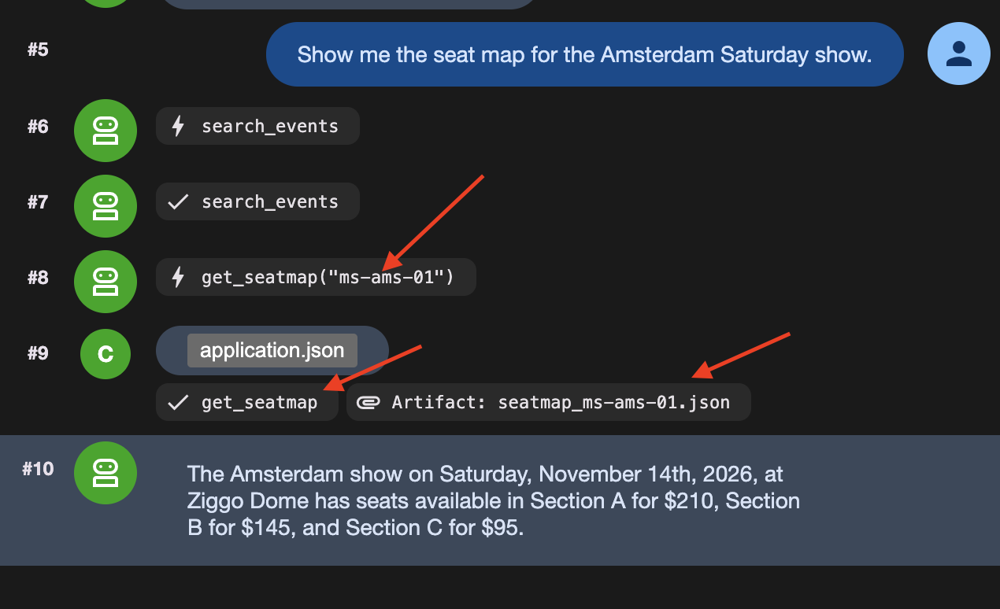


```
Actually, hold that thought — what else is on in Amsterdam?
```

That third message matters. It ends the turn that read the seat map, and ending a
turn is what makes `temp:` disappear.

Three things went into storage, in three different places:

| | What was stored | Which tool did it | Where it went |
|---|---|---|---|
| 1 | Sam can't do weeknights | `note_companion` | `user:prefs`, in session state |
| 2 | the full seat map, 6 KB | `get_seatmap`, via `save_artifact` | the artifact service |
| 3 | a one-line seat map summary | `get_seatmap`, into `temp:seatmap` | **nowhere** |

👉 Now check. The **State** tab and the **Artifacts** tab are on the left of
`adk web`.

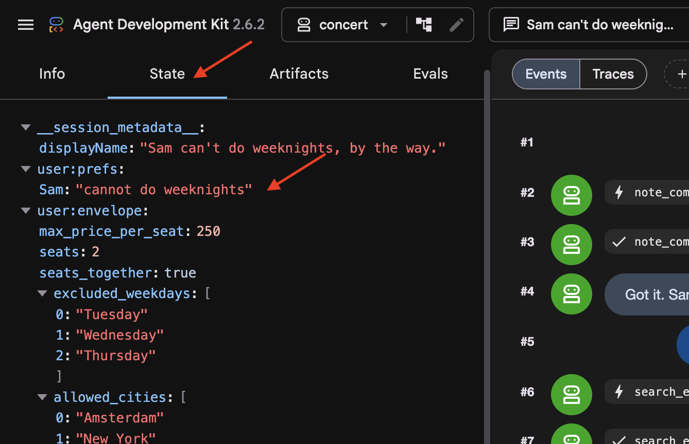

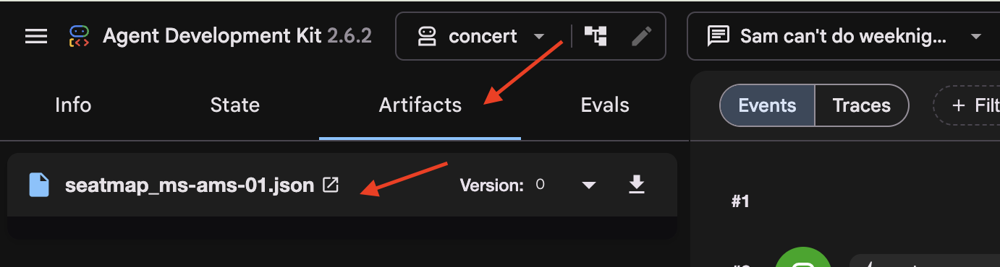

In the **State** tab, notice that `temp:seatmap` is omitted. State keys with a `temp:` prefix exist only during the active invocation and are automatically stripped by ADK before persisting session state to the database.

### Then the older conversation

👉 Switch to `two-days-ago` in the session dropdown at the top.

This session contains pre-populated conversation history in the database.

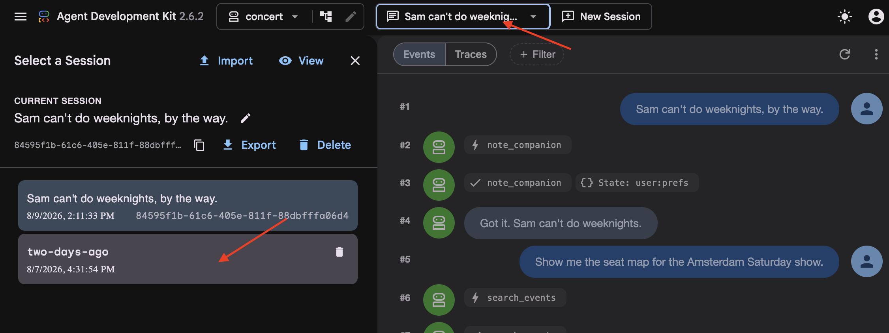

👉 Look at the **event stream** (the middle column). Notice that older turns have been replaced by a summarized event block.

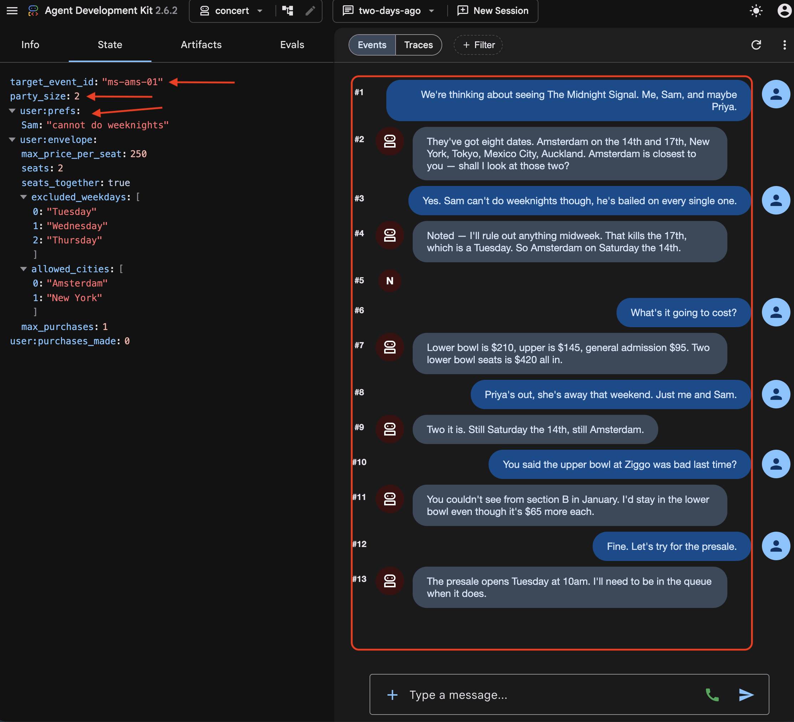

👉 Look at the **State** tab. Three kinds of key are sitting there together:

```
target_event_id   ms-ams-01                      ← plain: this booking only
party_size        2                              ← plain: this booking only
user:prefs        {"excluded_weekdays": [...]}   ← the person, every session
```

The `user:` prefix (e.g. `user:prefs`) scopes state across all sessions for a given user. In contrast, **unprefixed keys (`target_event_id`, `party_size`)** represent plain session state, which is scoped strictly to the active session and is deleted when the session ends.

👉 **Now compare the two State tabs.** While `user:prefs` and stored artifacts persist, `temp:seatmap` is absent from both sessions. State keys with a `temp:` prefix are strictly ephemeral and are never persisted to the database.

### Then the file

👉💻 Open it in the editor:

```bash
cloudshell edit ~/monstertix/memory/userx.md
```

Three bookings, going back to January. The agent reads it when it calls `recall()`, and it will still be there even if we lost the session data.

---

### The four places

| Where it lives | Survives the next message? | Survives a restart? | Survives deleting the session? |
|---|---|---|---|
| `temp:seatmap` | **no** | no | no |
| `party_size` — plain session state, in `two-days-ago` | yes | yes | no |
| `user:prefs` | yes | yes | **yes** |
| `memory/userx.md` | yes | yes | yes, and survives deleting the database |
| an artifact | yes | yes | depends on the service |

**Read that table as being about the containers, not about what is in them.**
`memory/userx.md` survives everything, and it only ever contains what `remember()`chose to put there. Nothing writes your current conversation into it. So the file outliving a session is not the same as the agent remembering what you were just talking about, and step 5 is where that distinction bites.

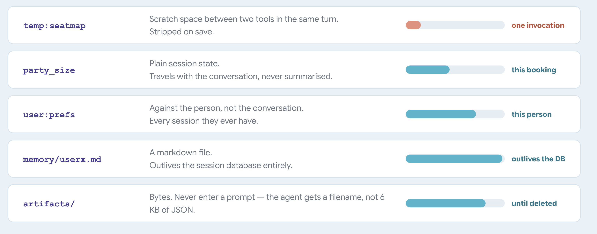

### What state is

Think of state as a dictionary that travels with the session. Read and write it from your tools through `tool_context.state`, and let ADK save it alongside the conversation.

**ADK assigns the meaning of the prefixes.** You do not define them anywhere. ADK reads the first part of the key name and uses it to decide where the value goes and how long it lasts:

| A key called | ADK stores it | Lasts |
|---|---|---|
| `party_size` | with the session | until the session is deleted |
| `user:prefs` | against the user | across every session that user has |
| `app:tour_id` | against the app | across every user |
| `temp:seatmap` | nowhere | one invocation |

An **invocation** is a single request-response cycle, including all model reasoning, tool execution, and the final response.

When an invocation ends, ADK writes the new state to the database and strips every `temp:` key on the way.


<aside class="positive">
<b>👀 Developer's Note — you will meet this again in two steps.</b> ADK's own <code>ResumabilityConfig</code> docstring says: <i>"Any temporary / in-memory state will be lost upon resumption."</i> Your agent is about to join a queue, stop running for forty minutes, and get woken up. <code>temp:</code> will not survive that.
</aside>

<aside class="positive">
<b>⌨️ Reference Prompt</b> Two changes, and the second is a whole interface:
<pre>In my ADK 2 agent:

1. Change get_seatmap so it does NOT return the full seat map. Save the whole
   JSON as an artifact with tool_context.save_artifact, and return only a
   short summary: the event, the sections with prices and availability, and
   the artifact filename. Everything a tool returns is added to the
   conversation and re-sent on every later turn, so a 6 KB return value is a
   6 KB tax for the rest of the session.

2. Stash that summary in state under a key prefixed `temp:`, so a purchase in
   the SAME turn can use it without it ever being persisted.

3. Write a BaseMemoryService implementation storing memories as Markdown at
   <root>/<user_id>.md. Implement both methods:
       async def add_session_to_memory(session)
       async def search_memory(*, app_name, user_id, query)
   Return ADK's own SearchMemoryResponse and MemoryEntry types, not dicts.
   Reads must NOT create the directory — only writes should — so a wrong path
   fails visibly instead of reporting an empty memory. When nothing is found,
   say which file was looked at.

4. Add recall() and remember() tools over that service, keyed off a fixed
   MEMORY_USER, not the session's user id.</pre>
<b>Check by hand:</b> that it returns <b>ADK's types</b>. A memory service returning a dict works right up until you swap it for Memory Bank. And check that reads do not <code>mkdir</code>: that one line turns "you are reading the wrong file" into "you have no memories", which is a much harder afternoon.
</aside>

---

#### One thing left unexplained

In `two-days-ago` you saw a summary sitting where somebody's first few turns used to be. Nothing you did put it there. ADK wrote it automatically once the conversation got long enough. Take that into the next step, which is about exactly this.

**Every fact has a shelf life**

---

## Context Degradation & Compaction

### Summaries Forget the Details

When a conversation gets too long, the system summarizes older messages to save space and tokens.

Summaries are good for catching the general gist, that are good to save some token usage. <- corret my english


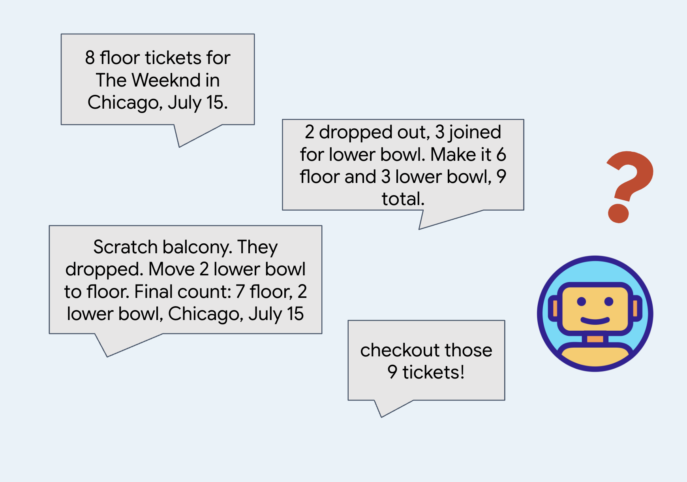

👉🔴 On the **venue panel**, press **RESET THE VENUE**. Every step starts from
the same world: 8 shows, all seats available, clock at 1×.

👉💻 Move to this step's code:

```bash
cd ~/monstertix
. ./set_env.sh
./use-solution.sh 5 --force
```

What changed since the last step:

| File | What changed |
|---|---|
| `agent.py` | the agent is wrapped in an `App`, with compaction switched on. A second agent, `budget_split`, does ticket arithmetic |
| everything else | unchanged |

`agent.py` no longer ends with `root_agent`. It ends with this:

```python
app = App(
    name="concert",
    root_agent=root_agent,
    events_compaction_config=EventsCompactionConfig(
        compaction_interval=3,   # summarise after every 3 turns
        overlap_size=1,          # re-read 1 turn either side when summarising
    ),
)
```

Know that `adk web` looks for a variable called `app` first and falls back to
`root_agent`. Wrap the agent in an `App` whenever you need something that applies
to the whole application rather than to one agent: compaction here, and
resumability two steps from now.

**`compaction_interval=3`** means ADK summarises after every three turns. One
turn is you saying something and the agent finishing its reply, however many tools
it called along the way. Three is small so it fires during a workshop. A real app
would use a much larger number.

**`overlap_size=1`** means each summary starts one turn earlier than it strictly
needs to.

ADK summarises turns 1, 2 and 3. Three turns later it summarises the next
batch. With `overlap_size=1` that second summary starts at turn 3 again, not
turn 4:

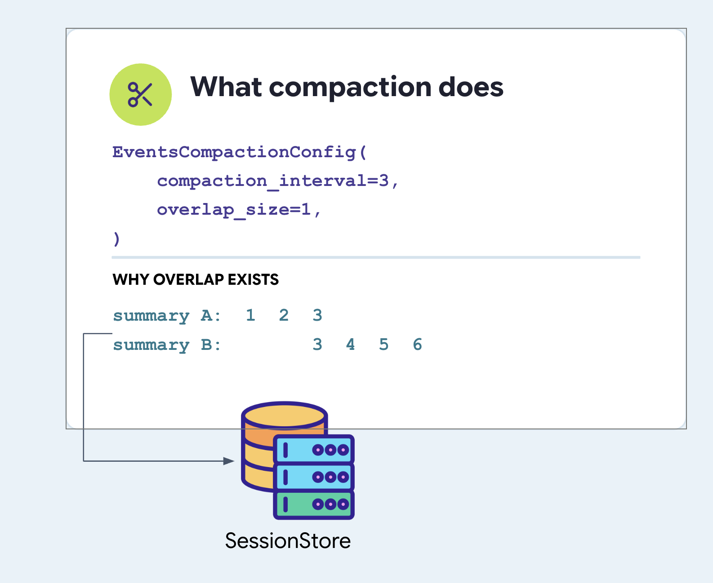

Notice turn 3 gets summarised twice. That is deliberate. If you asked a question
in turn 3 and the agent answered in turn 4, a clean split puts the question in one
summary and the answer in the other, and leaves both confusing. Repeating a turn
is cheap insurance against cutting a thought in half.

Set both fields. ADK has no default for either.

### Compaction and your memory service never meet

Worth being explicit, because the two words sound related and the systems are not.


`EventsCompactionConfig` is set on the **`App`** in `agent.py`, next to
`root_agent`. It is a property of the application, not of any service:

```python
# agent/concert/agent.py
app = App(
    name="concert",
    root_agent=root_agent,
    events_compaction_config=EventsCompactionConfig(
        compaction_interval=3,
        overlap_size=1,
    ),
)
```

Nothing in that block mentions memory, and nothing in `memory.py` mentions
compaction. **A summary rewrites the conversation. It does not rewrite the file.**

That is the whole reason `remember()` exists as a deliberate call. Anything left
in the transcript is eventually read as a paraphrase somebody else wrote;
anything written to the file is read exactly as it was stored, tomorrow and next
week. The end of this step is where you watch that difference land.

### Where the summary is actually kept

In `sessions.db`, in the **`events`** table — the same table as every other turn.
A compaction record is not a separate store or a separate file. It is one more
event row, written by the agent, with a timestamp like any other.

What makes it different is where the text sits. An ordinary event carries a
`content` field. This one does not: its summary lives under `actions.compaction`.

👉💻 Look at it in your own database:

```bash
cd ~/monstertix
. ./set_env.sh
sqlite3 sessions.db \
  "select json_extract(event_data,'\$.actions.compaction.compacted_content.parts[0].text')
   from events where event_data like '%compaction%';"
```

The shape, once you pull it apart:

```
events row
└── event_data  (JSON)
    ├── id, author, timestamp, invocation_id      ← like every other event
    ├── content                                    ← ABSENT on this one
    └── actions
        └── compaction
            ├── start_timestamp                    ← the window it replaced
            ├── end_timestamp
            └── compacted_content.parts[0].text    ← the summary itself
```

The event stream draws each event from its content. The summary is right there in the database, being sent to the model on every turn.

---

### The second agent

`budget_split` is a whole separate agent, not a tool:

```python
# agent/concert/agent.py
budget_split = Agent(
    name="budget_split",
    model=MODEL,
    include_contents="none",      # sees none of the conversation
    instruction="You do ticket arithmetic and nothing else...", #just the budget
    output_key="budget_plan",     # its answer goes into state
)

root_agent = Agent(
    ...,
    tools=[..., AgentTool(agent=budget_split)],
)
```


**Why an agent and not a plain function?** Because the work needs a model. Read "which of these sections fit a $200 budget for four people, and what is the total" as arithmetic wrapped in judgement, with an answer a person has to be able to read. Let a Python function multiply, and do not ask it to decide which options are worth mentioning.

**Then why not let the main agent do it?** Look at the next line `include_contents="none"` means this agent is handed **none** of the conversation. No group chat, no preferences, no forty tour dates. It gets the request and
nothing else. That flag only exists on an `Agent`, which is the real reason this is an agent rather than a function.

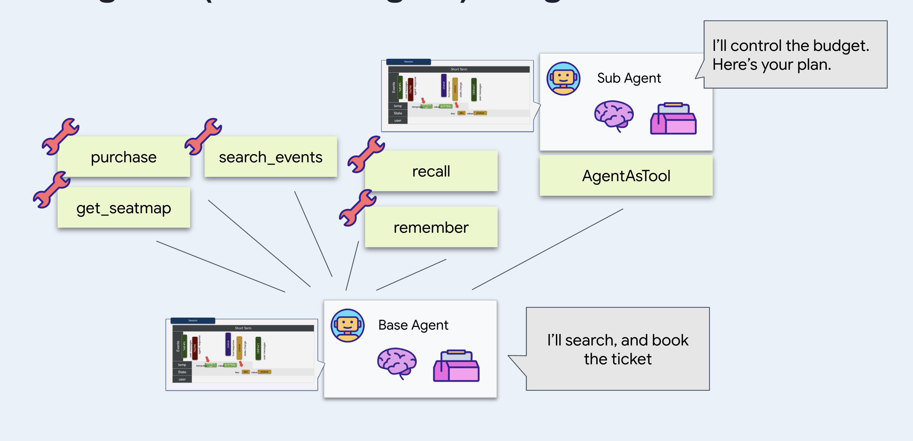

Prefer the short prompt: cheaper, faster, and much harder to derail. Rely on the arithmetic being immune to something said twenty turns ago, because it never sees it.

**Why `AgentTool`?** Wrap the agent with it so the main agent can call it like any other tool. From the model's side, read `budget_split` as identical to `search_events`.

**And `output_key="budget_plan"`** puts the answer into session state under that name instead of leaving it loose in the conversation. Watch why that matters.

---

### Run it

👉💻 In **terminal 1**, Ctrl-C and restart with the same flags:

```bash
cd ~/monstertix
adk web agent --port 8000 --allow_origins "*" \
  --session_service_uri="sqlite+aiosqlite:///$WORKSHOP/sessions.db" \
  --artifact_service_uri="file://$WORKSHOP/artifacts"
```

👉 Start a **New Session** and have a real conversation. Five or six turns.
This one works:

```
hello
```
```
what's on in Amsterdam?
```
```
Sam is coming with us, and he can't do weeknights
```
```
there are 4 of us and I can spend about $200 a head. What fits?
```
👉 Open the **State** tab.

Find `budget_plan` there, holding the arithmetic agent's full answer. 

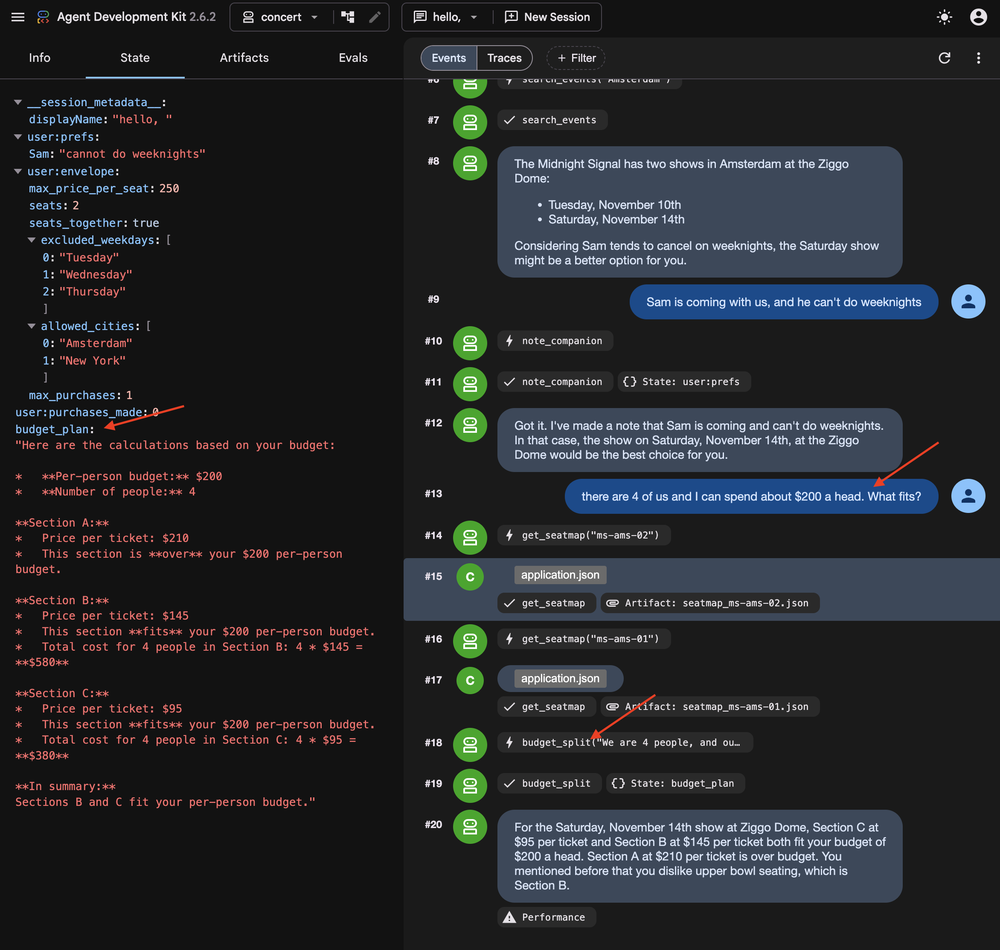

👉✨ Now change the numbers on it:

```
what if 10 people come and I can only do $120 each?
```

👉 Look at `budget_plan` again. It has been **overwritten**, not appended to. It's because `output_key` holds the latest one.

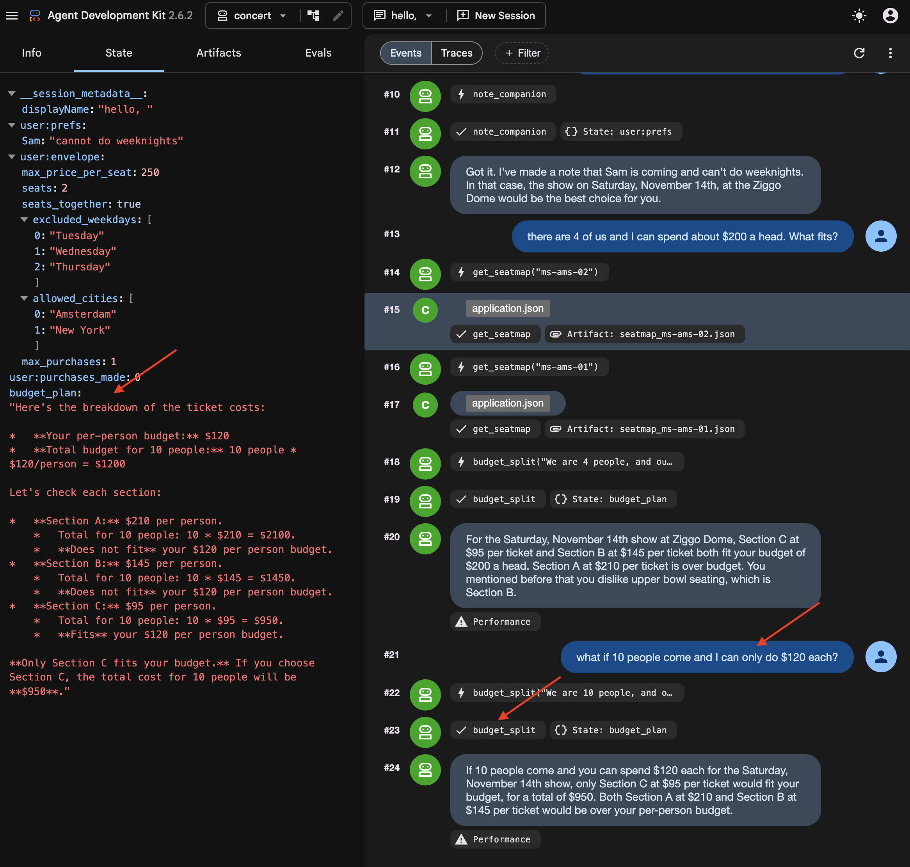


### What you cannot see: the summary

Somewhere in those turns, ADK summarised the earlier ones.


👉💻 In a new **Terminal**, run to read it directly:

```bash
cd ~/monstertix
. ./set_env.sh
./show-compaction.sh
```

<aside class="negative">
<b>⚠️ Nothing to show?</b> Compaction fires after three turns. If the script says nothing has been compacted yet, keep talking for another few turns and run it again.
</aside>

### Read what it wrote

Here is a real one, abridged:

```
── summary 1 ──────────────────────────────────────────────────────

Conversation Language: English

  **User Request:**
  The user initially wanted to know what concerts are playing in Amsterdam.
  Subsequently, the user provided a constraint regarding a companion, Sam.

  **Context Summary:**
  The user is planning a concert trip. The agent identified two events in
  Amsterdam: "The Midnight Signal" at the Ziggo Dome on Tuesday, November
  10 and Saturday, November 14, 2026. The user then informed the agent that a
  companion named "Sam" will be joining, but "he can't do weeknights." The
  agent has successfully noted this constraint for Sam.

  **Key Decisions/Information Obtained:**
  *   **City of interest:** Amsterdam
  *   **Events found:** "The Midnight Signal" at the Ziggo Dome, Tuesday
  10 November and Saturday 14 November 2026.
  *   **Companion:** Sam
  *   **Companion constraint:** Sam cannot attend concerts on weeknights.

  **Unresolved Questions/Tasks:**
  *   The agent has not explicitly confirmed if the found event (which is
  on a Saturday) is suitable given Sam's constraint, nor has it asked the
  user for the next steps regarding this event or further event searches.

  **Tools Used:**
  *   `recall`
  *   `search_events`
  *   `note_companion`
```

It kept the prices, the sections, the cities and the preferences, and correctly noted that nothing had been decided yet.

So look at what actually changed. Stop thinking of your conversation as what the model reads. **It gets this instead**: a description of your conversation, written by another model call, which you did not write and were never shown.

Three things follow from that:

**It is a paraphrase.** Nothing here is what anybody said. It is an account of what was said, produced by the same kind of process that produces everything else the model gets wrong occasionally.

*Note: Summary strings are stored in internal session event records and are not directly exposed as separate UI tabs.*

**It will happen again.** Every three turns, on a conversation that is now partly made of previous summaries.

### Try to book without repeating yourself

**In a new session** Do not start a new one — the summary you just read
lives in *this* session's events, and that is the only reason the agent still
knows anything about Amsterdam.

👉✨ Give it nothing new:

```
Book us something.
```

Watch the agent ask which show, which section, and how many people. Mark that **correct**: the summary itself says the user never confirmed anything, so the agent asked. Give compaction the credit.

Even when compaction succeeds, summarizing previous turns can introduce ambiguity that requires the agent to re-confirm constraints with the user.

👉✨ Answer it and let the booking go through:

```
Amsterdam Saturday, section C, 8 people
```

It reads the order back before it spends anything:

> *"You want to book 8 tickets in Section C for The Midnight Signal in Amsterdam
> on Saturday, November 14th. The total cost will be $760. Shall I go ahead and
> purchase these tickets?"*

👉✨ Confirm it:

```
yes
```

Now it tells you it worked:

> *"Your purchase of 8 tickets in Section C for The Midnight Signal in Amsterdam
> on Saturday, November 14th, totaling $760, is complete. Your order ID is
> ord_227877fe."*


<aside class="negative">
<b>⚠️ A new session would not pick up where this left off, and it is worth knowing exactly why.</b> Three different things are holding what you said, and only one of them travels. The <b>transcript and its summary</b> live in this session's events, so a new session starts blank. <b>Session state</b> like <code>budget_plan</code> is scoped to this session too, and goes with it. Only <code>user:prefs</code> and <code>memory/userx.md</code> cross the boundary. <b>Both survive, and neither helps</b>, which is not the contradiction it looks like: step 4's table was about which <i>stores</i> outlive a session, and this is about what is <i>in</i> them. Open <code>memory/userx.md</code> and you will find preferences and past bookings, because that is all <code>remember()</code> was ever called with. There is no line in it saying "we were discussing Amsterdam for four people", so a new session can read the whole file and still have no idea what "book us something" refers to.
</aside>

### Go and check whether it did

👉 Switch to the **venue panel**. Do not take the agent's word for it.

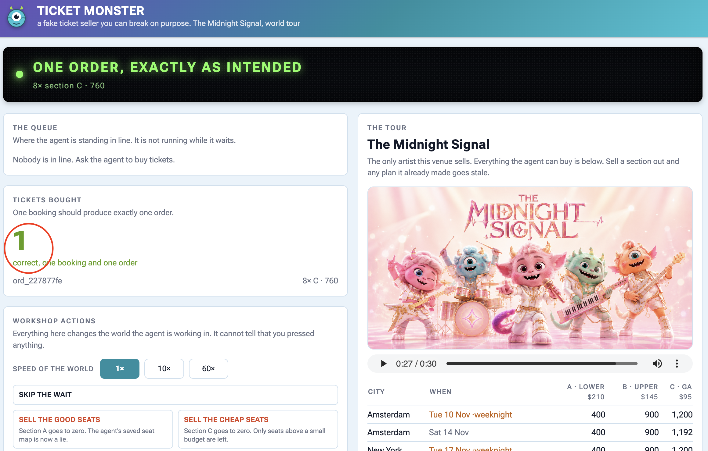

| On the panel | What you should see |
|---|---|
| **Tickets bought** | `1`, and *correct — one booking, one order* |
| the order underneath | `ord_xxxxxxxx — 8× section C · 760` |
| **The tour**, Amsterdam Saturday | section C is down by 8 |
| **Activity** | `ord_xxxxxxxx — 8x section C @ 95 = 760` |

Form this habit now, while the stakes are a mock ticket vendor. Check the panel to find out the ticket sale.

<aside class="positive">
<b>👀 Developer's Note — a good summary is still a summary.</b> This step is often taught as "compaction loses things", and sometimes it does. The sharper problem is that it always <i>paraphrases</i>. Your agent's memory of the last twenty turns is now a piece of generated text nobody reviewed. It is usually fine. When it is not, there is no error, no log line, and nothing in the UI — the agent simply believes something slightly different from what you said.
</aside>

<aside class="positive">
<b>⌨️ Reference Prompt</b> Turning on compaction, and isolating the arithmetic:
<pre>In my ADK 2 agent:

1. Wrap root_agent in an App and switch on automatic context compaction:
       EventsCompactionConfig(compaction_interval=3, overlap_size=1)
   Both fields are required and there is no default for either. Explain in a
   comment what overlap_size buys, and why summarising turn 3 twice is
   cheaper than splitting a question from its answer.

2. Add a second agent that does ticket arithmetic and nothing else:
       - include_contents="none", so it sees NONE of the conversation
       - output_key="budget_plan", so its answer lands in session state
         rather than loose in the transcript
       - a description saying to call it for ANY question about totals,
         per-seat costs, or which sections fit a budget
   Expose it to the main agent with AgentTool.

3. In the main agent's instruction, forbid doing the arithmetic itself, even
   when the sum looks trivial. Tell it to pass the budget, the party size and
   the sections with prices, because the sub-agent cannot see the
   conversation. If no budget has been named yet, ask for one first.</pre>
<b>Check by hand:</b> both flags on the sub-agent. Without <code>include_contents="none"</code> you have an expensive tool that inherits every distraction; without <code>output_key</code> the answer sits in the conversation, where the next summary is free to paraphrase it.
</aside>

### Why `user:prefs` was the right choice

Recall `note_companion` writing Sam's constraint into `user:prefs` last step, and the obvious objection: why bother with a tool when the agent could just remember it.

Here is why. Keep state out of the conversation and no summary touches it. Check `user:prefs` and `budget_plan` against how they went in, and find them unchanged. Then check the transcript.

> **A summary keeps the general shape and loses the details. Store anything you
> cannot afford to lose somewhere other than the conversation.**

---

## Process Resumption

### Waiting 40 Minutes Without Staying Online

When an agent has to wait in a 40-minute ticket queue, keeping a Python process alive and waiting is fragile and expensive.

To handle long waits properly:
1. **Save state to a database**: Store where the agent paused so the process can safely shut down.
2. **Wake up on demand**: When the wait is over, an external signal restarts the agent and resumes execution right where it left off.

👉🔴 On the **venue panel**, press **RESET THE VENUE**. Every step starts from
the same world: 8 shows, all seats available, clock at 1×.

👉💻 Move to this step's code:

```bash
cd ~/monstertix
. ./set_env.sh
./use-solution.sh 6 --force
```

### Run it

What changed since the last step:

| File | What changed |
|---|---|
| `tools.py` | added `join_queue` and `check_queue` |
| `agent.py` | `join_queue` is wrapped in `LongRunningFunctionTool`, and the `App` turns on `ResumabilityConfig` |

`join_queue` returns straight away with a ticket instead of blocking, and
`ResumabilityConfig` lets the run pause on it and pick up afterwards.

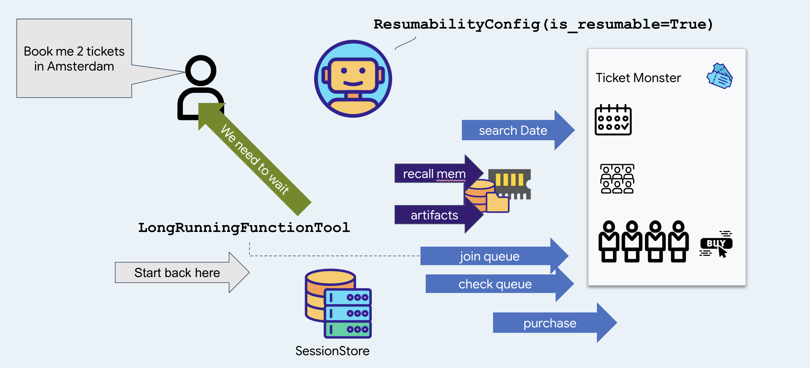


👉💻 **Terminal 1** — the agent, unchanged:

```bash
cd ~/monstertix
. ./set_env.sh
adk web agent --port 8000 --allow_origins "*" \
  --session_service_uri="sqlite+aiosqlite:///$WORKSHOP/sessions.db" \
  --artifact_service_uri="file://$WORKSHOP/artifacts"
```


👉✨ Ask the agent to buy:

```
Get us two tickets to the Amsterdam show.
```

It calls `recall`, then `search_events`, then `join_queue`, and answers with something close to this:

```
You are in the queue for The Midnight Signal at Ziggo Dome, Amsterdam, on Saturday, November 14. Your position is 14203.
```

Stop on two things in that answer.

Notice it picked **Saturday** without asking you. There are two Amsterdam shows, the 17th is a Tuesday, and the memory file from the last step says Sam does not do weeknights. That is a fact from a previous booking deciding a question in this one.

Notice too that it joined the queue **before** looking at a single seat or price, and said nothing about either. That is the venue's rule, you buy the tickets until they reach the front, so the only thing worth having early is a place in line. Which seats to take is a question for forty minutes from now.


👉 Look at the control panel. The banner reads:

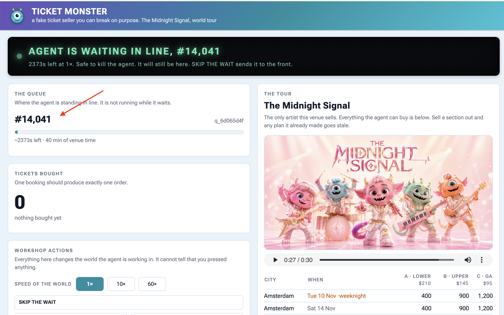
```
Agent is waiting in line — #14,203
About 2400s at 1×. Safe to kill the agent right now — it will still be here.
```

The queue is genuinely forty minutes long and it is not going anywhere while you
work.

<aside class="positive">
<b>👀 Developer's Note: Venue Speed Multiplier.</b> The speed multiplier determines how fast the queue is processed (default <b>1×</b>). Use <b>SKIP THE WAIT</b> to move to the front immediately, or set the speed to <b>60×</b> to accelerate processing. The agent code behaves identically regardless of clock speed.
</aside>


👉💻 **Kill the agent.**:

```
Ctrl-C
```

👉💻 Start it again in **terminal 1**:

```bash
cd ~/monstertix
. ./set_env.sh
adk web agent --port 8000 --allow_origins "*" \
  --session_service_uri="sqlite+aiosqlite:///$WORKSHOP/sessions.db" \
  --artifact_service_uri="file://$WORKSHOP/artifacts"
```

👉✨ In the same session, ask the agent where it is in line:

```
Where am I in line?
```

```
You are currently at position 12982 in the queue. It is not your turn yet.
```

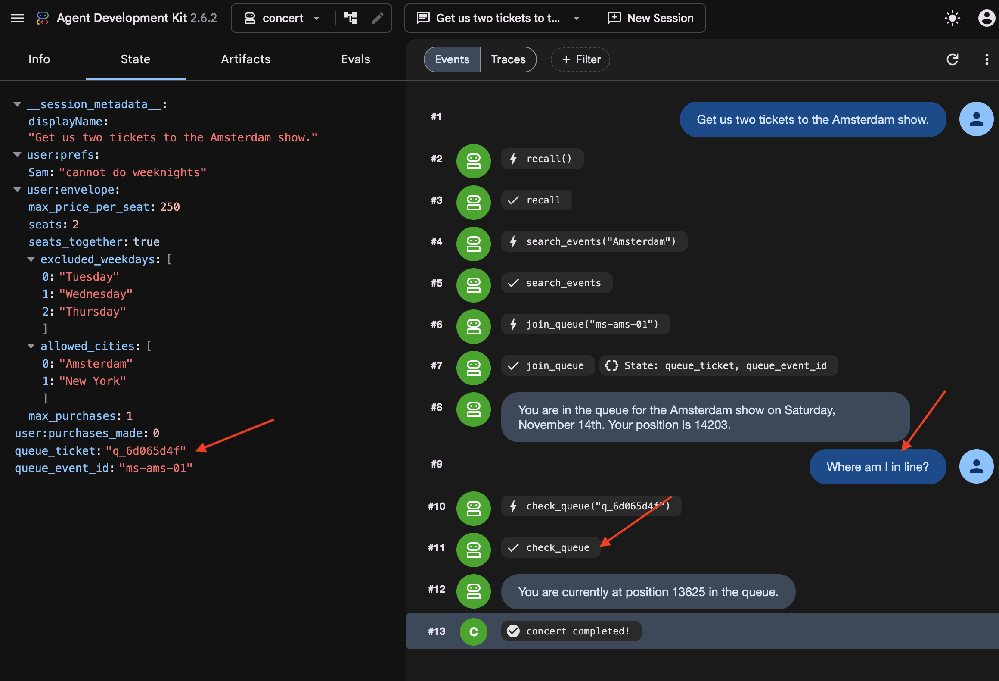

**Compare the ticket, and watch the position keep dropping while nothing was running.** Notice the agent did not know it had been killed. It called `check_queue` with the ticket it got before the restart, because that ticket was on disk.

👉💻 See why:

```bash
cd ~/monstertix
sqlite3 sessions.db "select name from pragma_table_info('events');"
```

```
id
app_name
user_id
session_id
invocation_id
timestamp
event_data
```

Six of the coloumns are labels. Every turn of every conversation is one row, and the turn itself, who said it, which tool it called, what came back,
is JSON inside `event_data`.

👉💻 Find your queue ticket in there:

```bash
sqlite3 sessions.db "select event_data from events;" \
  | grep -o '"ticket": "q_[a-z0-9]*", "position": [0-9]*' | tail -1
```

```
"ticket": "q_8cc2c6f9", "position": 14203
```

**That is the whole trick.** The ticket the venue gave you went to disk the moment `join_queue` returned, and killing the process did not touch it. When `adk web` came back it read these rows and handed the model the same conversation it had before, ticket included. So watch the agent carry on without ever knowing it had been dead.

**And notice what it did not do: start over.** It did not search the tour again, and it did not join the queue a second time. The events on disk record not just what was said but *where the run had got to* — parked on a `LongRunningFunctionTool` that had returned a ticket and was waiting on the queue. `ResumabilityConfig` is what makes that position part of the record rather than something living only in the dead process's memory, so the run picks up at that tool instead of replaying everything before it.

That distinction matters more than it looks. Replaying would mean a second `join_queue` call, a second ticket, and a place at the back of a queue of 14,203 people — the run would get further from finishing every time it was resumed.

<aside class="positive">
<b>👀 Developer's Note — there is no <code>author</code> column.</b> In ADK 2.6.2 the events table is deliberately thin: identifiers, a timestamp, and one <code>event_data</code> blob. Everything else lives inside the JSON. If you want to query by author, pull it out with <code>json_extract(event_data, '$.author')</code>.
</aside>

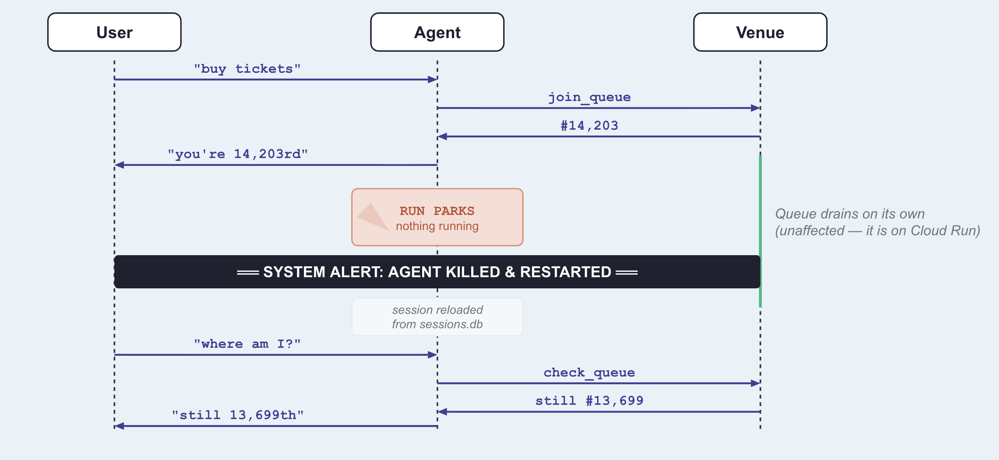

### Why `join_queue` and not `check_queue`

Both functions return in milliseconds. Only one of them is long-running, and the
difference is not how long the call takes — it is whether the **work** is
finished when the call returns.

| | what it returns | is the work done? |
|---|---|---|
| `join_queue` | a ticket, and position 14,203 | **no.** You are queued, not at the front. Forty minutes of it are still ahead |
| `check_queue` | a position, right now | **yes.** You asked a question, you got the answer |

`join_queue` hands back a *handle to something still in progress*. That is
exactly what `LongRunningFunctionTool` models: the tool returns, the work carries
on somewhere else, and the run is allowed to pause on it.

`check_queue` is a complete question with a complete answer. There is nothing
pending to wait for, so there is nothing to park on.

**And wrapping it would actively break the step.** If `check_queue` were long-running,
the run would park every time the agent asked where it was in line — including
when the answer is *"you are at the front, buy now"*. You would have built an
agent that suspends itself at the exact moment it should act.

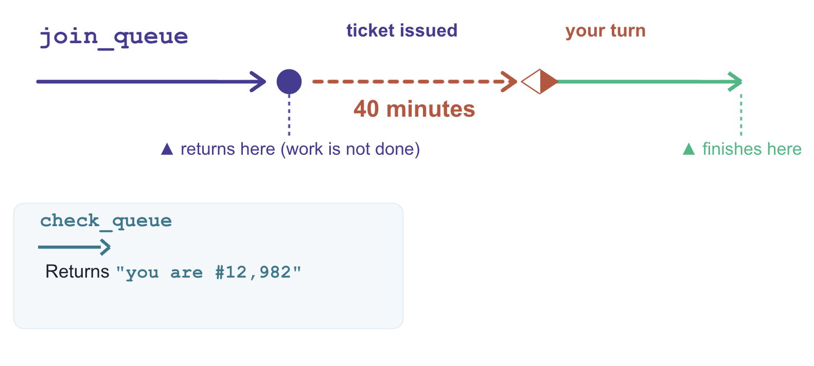

### What made that work

Three separate things, and it is worth being clear about which does what, because they are easy to confuse.

```python
# agent/concert/agent.py
LongRunningFunctionTool(func=join_queue)      # the tool returns without finishing
ResumabilityConfig(is_resumable=True)         # the run may pause and be picked up
```
```bash
--session_service_uri="sqlite+aiosqlite:///$WORKSHOP/sessions.db"
```

| | Job | Take it away and |
|---|---|---|
| `LongRunningFunctionTool` | lets `join_queue` hand back a ticket without the call being finished, so the invocation has something to wait on | `join_queue` becomes an ordinary tool. It returns the ticket, the agent reads it as a final answer and replies, and the turn ends. Nothing is waiting, so there is nothing to come back to |
| `ResumabilityConfig` | lets ADK park an invocation on that unfinished call and continue it later, from the last event | the tool still returns early, but the run cannot be suspended and resumed. There is no paused invocation to continue |
| the session URI | puts the session somewhere a new process can read | see below — this one is not what you expect |


<aside class="positive">
<b>👀 Developer's Note — read ADK's own docstring for <code>ResumabilityConfig</code>:</b>
<br><br>
<i>"1. pause an invocation upon a long-running function call. 2. resume an invocation from the last event, if it's paused or failed midway through. Note: ADK resumes in a best-effort manner: 1. Tool call to resume needs to be idempotent because we only guarantee an at-least-once behavior once resumed. 2. Any temporary / in-memory state will be lost upon resumption."</i>
</aside>

<aside class="positive">
<b>⌨️ Reference Prompt</b> The two lines that make a pause possible:
<pre>In my ADK 2 agent, make waiting free.

1. Change join_queue so it returns IMMEDIATELY with a queue ticket instead of
   blocking. Wrap it as a LongRunningFunctionTool.

2. Add check_queue(ticket) reporting the current position and whether it is
   ready.

3. Put ResumabilityConfig(is_resumable=True) on the App, so the invocation can
   pause on that tool and be resumed later.

4. In the instruction:
   - join the queue as soon as the show is known; a section and a price are
     not needed to take a place in line
   - do NOT poll check_queue in a loop
   - never quote a queue position from memory. Call check_queue immediately
     before stating a position and immediately before any purchase, because
     the line moves while you talk and somebody may have skipped you forward
   - after being woken, do not trust anything looked up before the wait</pre>
<b>Check by hand:</b> Ensure `--session_service_uri` is passed at runtime. Without external persistent session storage, sessions remain in-memory and state will be lost on process restart.
</aside>

> **The agent was not running for those forty minutes. Something outside it
> noticed the wait was over and started it again.**

---

## Acting on Stale Data

### Information goes out of date while you wait

Long-running agents store history, and history is not the same as truth. Time
passes while the agent waits, and the world moves on without telling it.

An agent that is *missing* information asks you for it. An agent holding
*out-of-date* information just acts, and sounds completely certain doing it.
Nothing is missing from its context — the wrong thing is present.

So some facts have to be read again in the instant before they are used, and
this step is about which ones and how.

**Do not load new code yet.** Stay on the previous step's agent (it can buy tickets, but currently has no safeguards for staleness or idempotency).

👉🔴 Press **RESET THE VENUE**, then start a **new session** in `adk web` —
the **+ New Session** button above the chat.

Clear out the queue ticket and half-finished purchase the last step left in your
old session. The demo below depends on watching one clean run, so start from
nothing.

### The snapshot lies

👉✨ Ask for the same show as before:

```
Get us two tickets to the Amsterdam show.
```

👉✨ Now, while it waits in line, ask about seats:

```
How much are the seats, and what's still available?
```

```
Section A: $210 per ticket, with 400 seats available.
Section B: $145 per ticket, with 900 seats available.
Section C: $95 per ticket, with 1200 seats available.
```

**Those numbers are now sentences in the conversation.** They are true right now.
In thirty seconds one of them will not be.

👉🔴 Press **SELL THE GOOD SEATS**. Section A drops to zero.

👉🔴 Press **SKIP THE WAIT** to send the agent to the front of the queue.

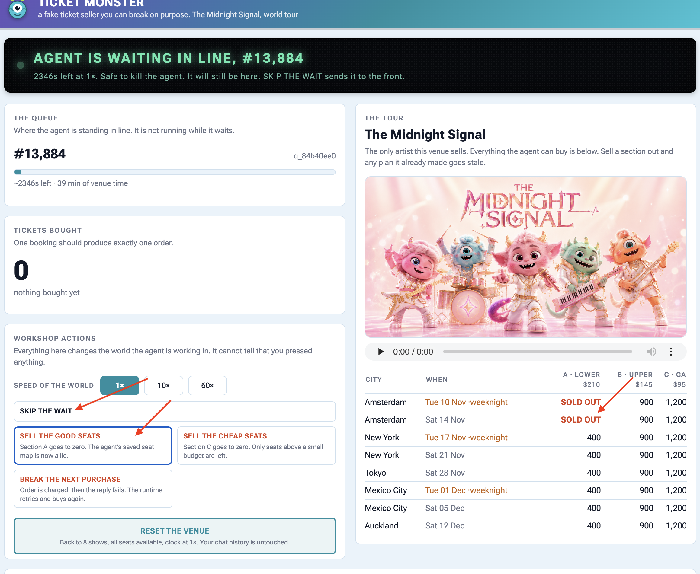

👉✨ Tell it to buy:

```
Buy the two section A seats.
```

It executes `purchase(section="A")` without re-verifying seat availability, causing the venue API to return an error response:

```
{"error": "sold_out", "available": 0,
 "message": "those seats are gone — re-fetch the seatmap before buying"}
```

```
Oh no! It looks like the Section A tickets just sold out. Let me get an
updated seat map to see what's still available.
```

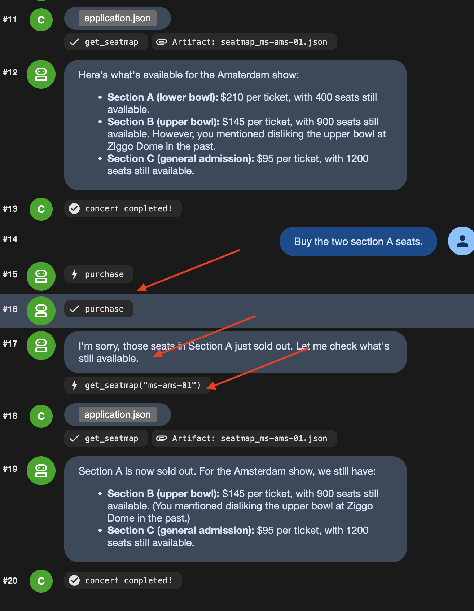

Notice the agent only re-queried the seat map **after** receiving an API error response. The root cause is stale context: earlier in the session, the agent recorded "section A: 400 available", and that turn remained in the conversation history passed to the model.

Be clear about where the old information is stored: it persists in the **conversation history**, which state prefixes like `temp:` cannot override.

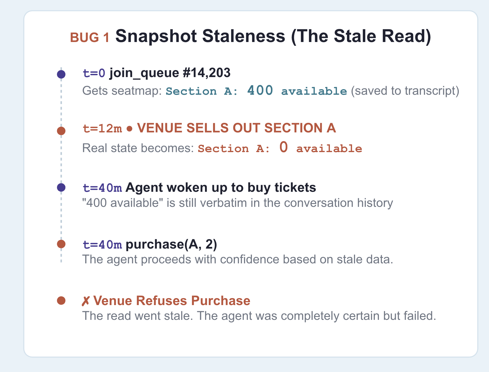

### The fix

👉🔴 On the **venue panel**, press **RESET THE VENUE**. Every step starts from the same world: 8 shows, all seats available, clock at 1×.

👉💻 *Now* load this step's code:

```bash
cd ~/monstertix
. ./set_env.sh
./use-solution.sh 7 --force
```

👉💻 In **terminal 1**, Ctrl-C and restart:

```bash
cd ~/monstertix
. ./set_env.sh
adk web agent --port 8000 --allow_origins "*" \
  --session_service_uri="sqlite+aiosqlite:///$WORKSHOP/sessions.db" \
  --artifact_service_uri="file://$WORKSHOP/artifacts"
```

What changed:

| File | What changed |
|---|---|
| `fence.py` | new. Runs immediately before a purchase and can block it |
| `agent.py` | `before_tool_callback=refresh_before_purchase` |
| `tools.py` | `purchase` now sends an `Idempotency-Key` header |

`fence.py` is a callback ADK runs in the moment before any tool call:

```python
root_agent = Agent(
    ...,
    before_tool_callback=refresh_before_purchase,   # re-read inventory, then decide
)
```

The second change is for a failure you have not seen yet, and will.

**Something you did not write is going to retry your purchase.** The order
commits, the response dies on the way back, and from where the agent stands a
successful purchase and a failed one look identical. So it tries again. In the
final step ADK's own Pub/Sub trigger does this for you
(`ADK_TRIGGER_MAX_RETRIES`, default 3); elsewhere it is a load balancer, a queue,
or a person clicking twice. ADK's `ResumabilityConfig` docstring says it plainly:

> *"Tool call to resume needs to be idempotent because we only guarantee an
> at-least-once behavior once resumed."*

**At-least-once means more than once, sometimes.** You cannot stop the retry, so
the venue has to be able to recognise it — and that means the second attempt has
to arrive carrying something the first one had.

Derive that key from the request itself, so a retry of the *same* purchase
produces the *same* key, while a genuinely different purchase produces a
different one:

```python
# agent/concert/tools.py
key = hashlib.sha256(
    f"{tool_context.session.id}:{event_id}:{section}:{seats}".encode()
).hexdigest()[:24]

venue.post("/purchase", body, headers={"Idempotency-Key": key})
```

### Prove it

👉🔴 **RESET THE VENUE**. Queue up, press **SELL THE GOOD SEATS** mid-wait, then tell it to buy section A.

This time it stops itself. Watch the agent say something like:

> *"It looks like Section A just sold out. I need to re-read the seat map."*

Then watch it call `get_seatmap` again, unprompted, and come back offering section C instead.

👉🔴 **Read the venue's activity feed carefully**, because it shows both halves:

```
error  purchase failed: Section A has 0 seats left, 2 requested. Re-read the
       seat map and pick again.
agent  calling purchase
```

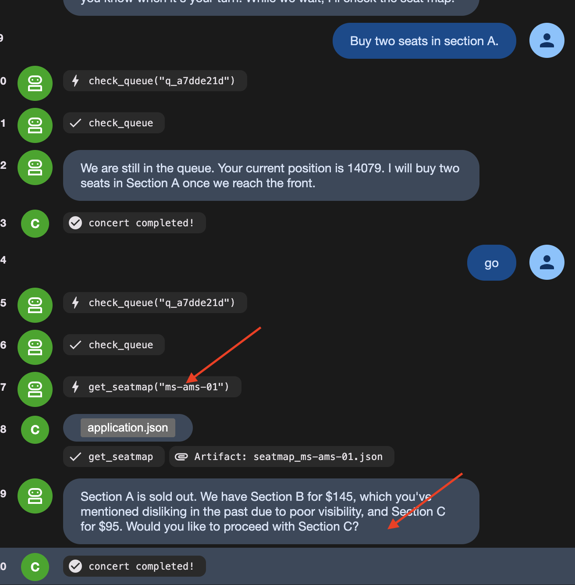

**`calling purchase` is there, and no order was created.** Those two are not in conflict. `panel.py` reports every tool call to the feed so you can watch the agent work, so the attempt is logged. `fence.py` runs after it, re-reads the seat map, and returns a dict — and returning a dict short-circuits the tool. So `purchase` in `tools.py` never runs, the venue's `/purchase` endpoint is never called, and **Tickets bought does not move.**

That is the shape of the fix worth remembering. The agent still tried, and nothing stopped it from wanting to. The callback stopped the wanting from reaching the world, which is what an instruction could never do.

👉🔴 Now prove the key works. Press **RESET THE VENUE**, then **BREAK THE NEXT
PURCHASE** — that button makes the venue commit an order and then fail the
response, which is exactly the situation a retry is born from.

👉✨ Ask it to buy, and let it retry as many times as it likes.

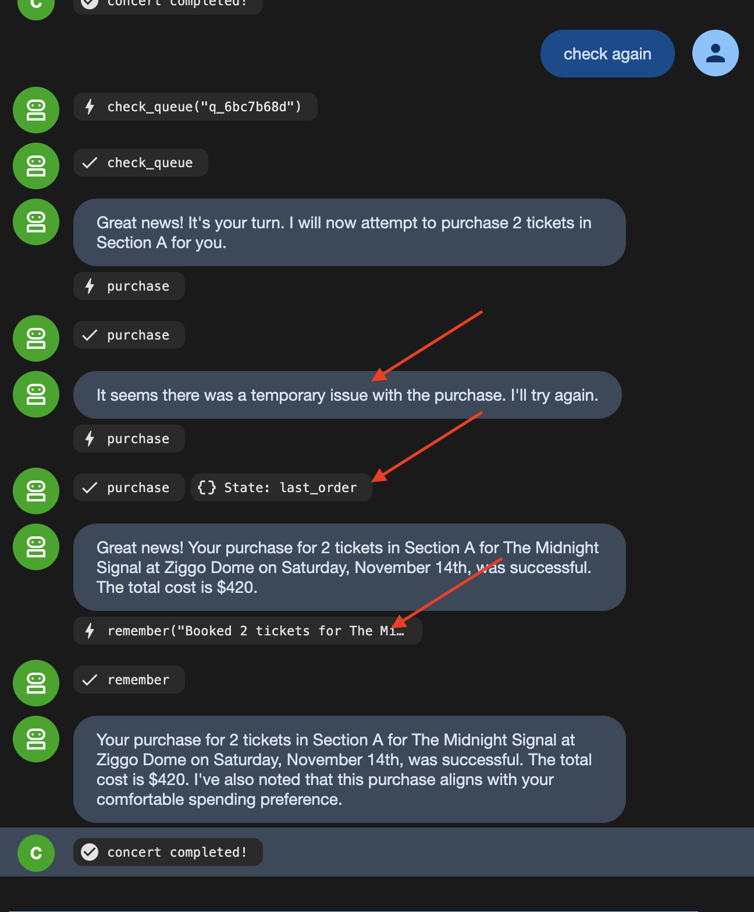

**Check the order count. It stays at 1.** The venue saw the same key twice and
handed back the original order instead of writing a second one. Without the key
you would be holding two pairs of tickets and an agent quite certain it bought
one.

<aside class="positive">
<b>👀 Developer's Note:</b> ADK 2 also ships <code>runner.rewind_async(rewind_before_invocation_id=...)</code> to roll state back to before a bad decision.
</aside>

<aside class="positive">
<b>⌨️ Reference Prompt</b> Two bugs, two different shapes of fix:
<pre>In my ADK 2 agent, stop it acting on old news and stop it paying twice.

1. Add a before_tool_callback that runs before EVERY purchase:
   - re-fetch the seat map live
   - if the chosen section now has fewer seats than requested, block the call
     by returning a dict, and say what was believed versus what is true
   - if the price moved, block and say so
   - otherwise let it through
   Returning a dict short-circuits the tool, so the purchase never reaches
   the venue.

2. Send an Idempotency-Key header on every purchase, derived from a hash of
   the session id, event, section and seat count — so a retry of the SAME
   purchase produces the SAME key, and a different purchase does not.

3. Have the venue return the ORIGINAL order when it sees a key it has already
   honoured, rather than creating a second one.</pre>
<b>Check by hand:</b> that the guard is a <b>callback</b> and not a line in the instruction. Ask for it in the prompt and the model complies most of the time. Ask for it in code and it complies every time, which is the entire difference.
</aside>

> **Information goes out of date. For an agent that waits, when it read
> something matters as much as what it read.**

---

## Autonomous Workflow

### LLMs Are Bad at Following Rigid Rules Every Single Time

LLMs are great at making decisions (like picking a show based on user preferences). But relying on an LLM to follow strict step-by-step rules (like "always join the queue before checking seats") means it will occasionally skip steps or mess up the order.

To fix this, split the workflow into two types of steps:
- **Fixed Rules (Code Functions)**: Steps that must happen the exact same way every time (taking a queue ticket, checking position) are written as ordinary code nodes.
- **Decisions (Agent Nodes)**: Steps requiring judgment (choosing seat sections, checking user preferences) are given to the AI agent.

**Look at what is actually in this flow.** Some of it has no judgement in it at
all:

| Step | Judgement? |
|---|---|
| take exactly one queue ticket | **no.** Always one, always before buying |
| check whether it is your turn | **no.** Ask, read the answer |
| write the brief for the buyer | **no.** Same sentence, same shape, every time |
| which show, which section | **yes.** Price, day, who is coming, what they hate |
| user perference and limitation | **yes.** |

Everything in the first group is a rule. Leaving a rule to a model means it is
followed *nearly* always, and at 3am nobody is watching the time it is not.

So **ADK's `Workflow` lets you make the fixed parts deterministic and keep an agent only where a decision genuinely needs one.** Rules become function nodes that run the same way every time. Judgement stays in agent nodes. The wait becomes a node that parks the run instead of sleeping through it.

**Your agent is not replaced by any of this.** It becomes the last node in that
graph, with every tool, callback and idempotency key intact. The graph decides
what happens and in what order. Your agent still does the buying.

👉🔴 On the **venue panel**, press **RESET THE VENUE**. Every step starts from
the same world: 8 shows, all seats available, clock at 1×.

👉💻 Move to this step's code:

```bash
cd ~/monstertix
. ./set_env.sh
./use-solution.sh 8 --force
```

### Run it

👉💻 In **terminal 1**, Ctrl-C and restart. Same command as always:

```bash
cd ~/monstertix
. ./set_env.sh
adk web agent --port 8000 --allow_origins "*" \
  --session_service_uri="sqlite+aiosqlite:///$WORKSHOP/sessions.db" \
  --artifact_service_uri="file://$WORKSHOP/artifacts"
```

What changed since the last step:

| File | What changed |
|---|---|
| `nightly.py` | new. The unattended run as an ADK 2 `Workflow` graph |
| `agent.py` | `root_agent` **is now the graph.** The agent you have been talking to is still there, renamed `buyer_agent`, and is one node inside it |
| `agent.py` | it also **lost `join_queue` and `check_queue`** — the graph owns the queue now |

### Run the graph — three messages, in order

Do everything below in the **`nightly`** app, not `concert`. Send the same word
every time and watch the graph change instead.

#### 1. Notice what you are now talking to

👉 Reload the **ADK web UI**. The dropdown still says `concert` — but what
answers is no longer the agent you have been chatting with:

```python
# concert/agent.py, at the bottom

buyer_agent = Agent(name="concert", ...)   # ← everything you built, renamed

from .nightly import nightly
root_agent = nightly                       # ← what adk web actually runs
```

Note that `adk web` executes whichever object is assigned to `root_agent`. Here, `root_agent` points to the `nightly` Workflow graph, with `buyer_agent` configured as the final node in the graph.

<aside class="negative">
<b>⚠️ <code>adk web</code> treats every folder under <code>agent/</code> as an app,</b> and if any one of them is not a valid agent package the whole dropdown fails to load. Running things from inside <code>agent/</code> can leave a stray <code>memory/</code> or <code>artifacts/</code> folder behind, which is enough to do it. <code>ls agent/</code> should show <code>concert/</code> and nothing else. <code>./use-solution.sh 8</code> tidies it for you.
</aside>

#### 2. Start it

👉✨ Type this and press enter:

```
go
```

Note: In an automated workflow graph, initial execution starts without waiting for user input. Sending a message in `adk web` triggers the initial run.

👉 **Now look at the web browser.** The left panel draws the graph and colours in the nodes as they run. The right panel is the event stream, watched how the decisions are being made:

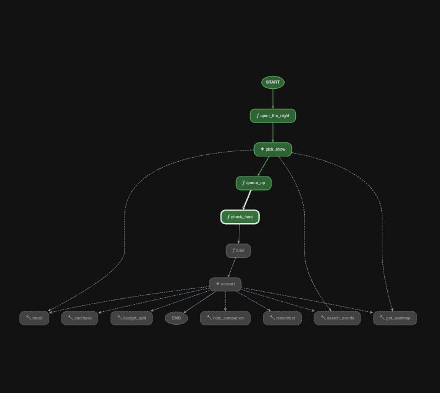


Watch `queue_up` write **`queue_ticket`** and **`queue_event_id`** into session state.

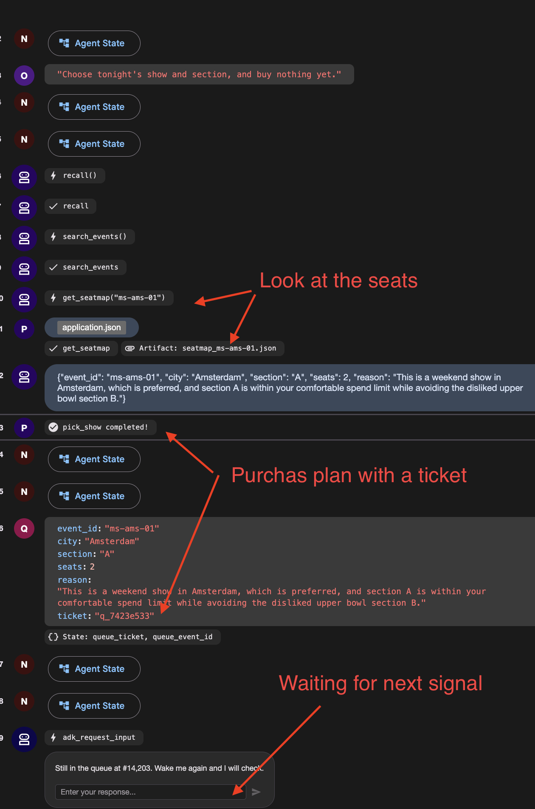

You should see a function call named `adk_request_input`, waiting for an answer. Then it goes quiet and the run ends. The graph reached `check_front`, found you 14,203rd, and stopped. Look
for a process holding your place and find none.

👉 Check the **venue panel**: one queue ticket, and nothing running.

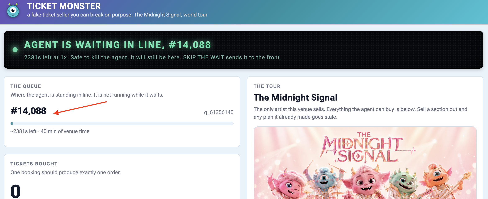

#### 3. Wake it up — and mind which box you type in

Scroll the event stream to the **`adk_request_input`** event and locate the input box associated with that specific event:

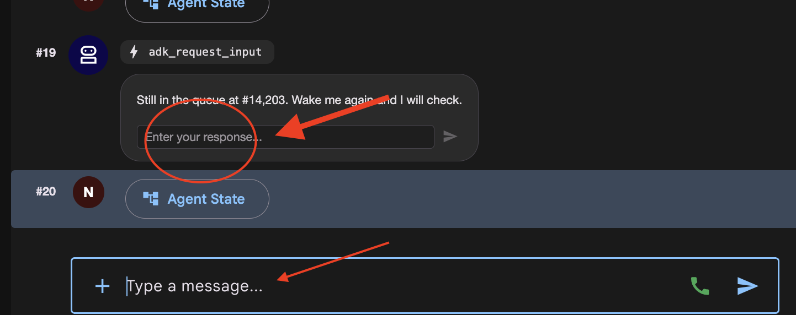

**There are now two places you can type, and they do different things.**

| Where you type | What happens |
|---|---|
| the **`Enter your response...`** box on the `adk_request_input` event | answers the interrupt. The parked run **continues** from `check_front` |
| the main chat box at the bottom | starts a **new** invocation. The graph replays from `START`, picks a show again, and takes a **second queue ticket** |

<aside class="negative">
<b>⚠️ Use the box attached to the event, not the chat box at the bottom.</b> This is the difference between resuming a parked run and starting a new one, and the two look identical until you check the venue panel and find two tickets. Everything <code>rerun_on_resume</code> does depends on getting this right.
</aside>

👉✨ Type anything into the **`Enter your response...`** box and press the arrow.

👉 Terminal 1:

```
[check_front] #14,197 — not yet. Pausing.
```

**One line.** It did not pick a second show and it did not take a second queue
ticket, which would have put you at the back of a queue of 14,203.

If you see `[open]` and `[pick_show]` run again, you typed in the chat box.
Press **RESET THE VENUE** and start the step over.

👉 Check the **venue panel** again: still **one** ticket, and the position has
dropped a little because the venue's clock kept running while nothing of yours
did.

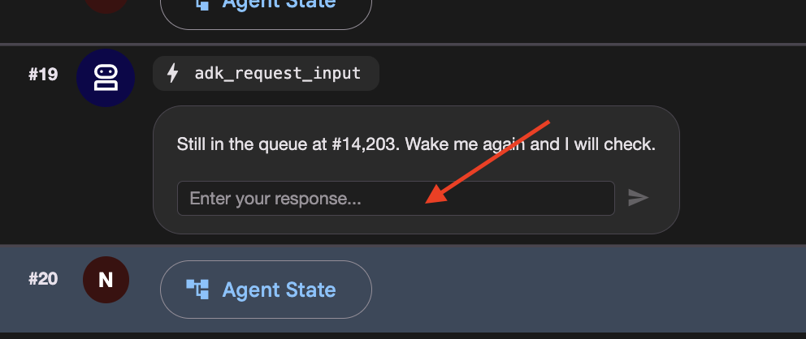

#### 4. Get to the front, then finish

👉🔴 Press **SKIP THE WAIT** on the venue panel.

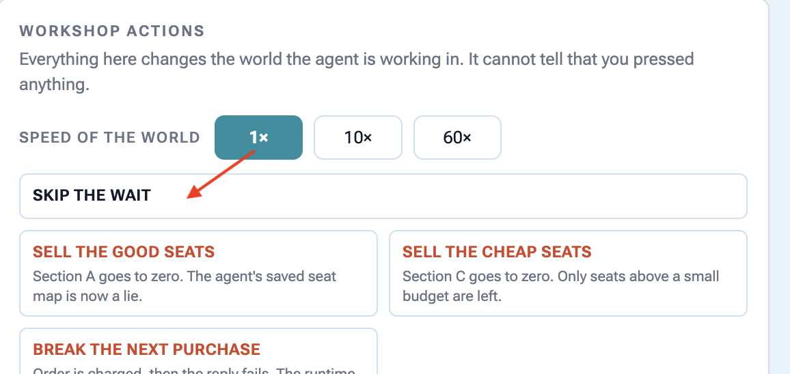

👉✨ Answer the newest `adk_request_input` event one last time — again in **its** box, not the chat box.
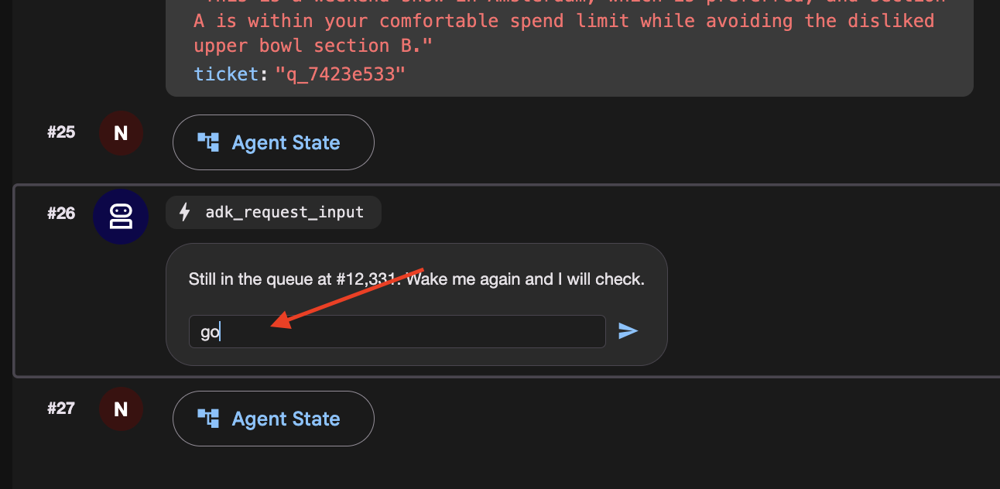

This time watch `check_front` find you at the front and fall through. Watch the left panel light up `brief` and `concert`, the last two nodes.

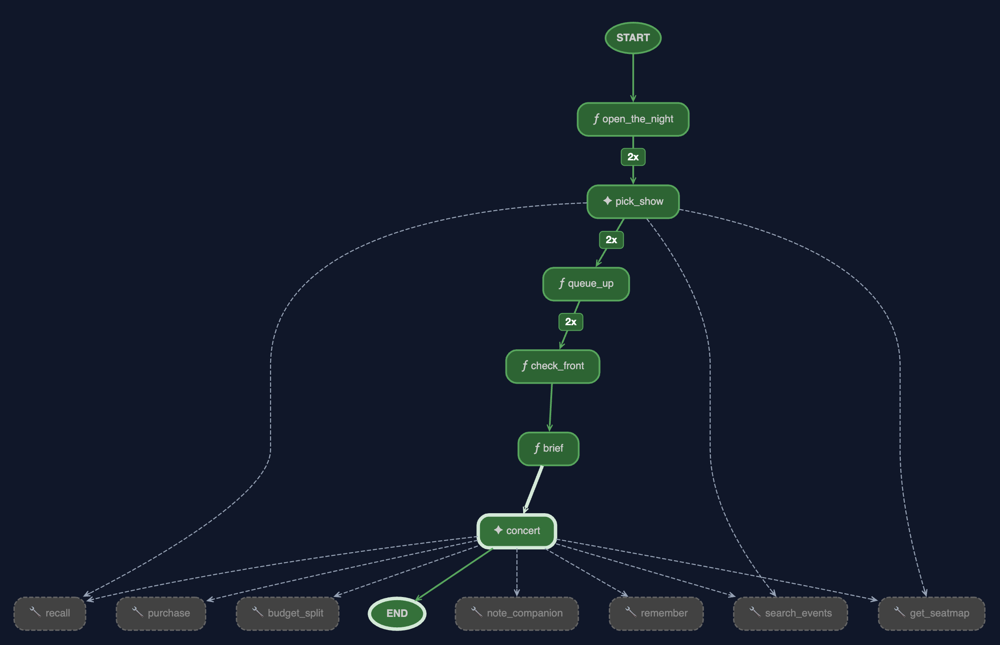

👉 **And look at the browser.** This is the run finishing, and there are four
things in it worth reading.

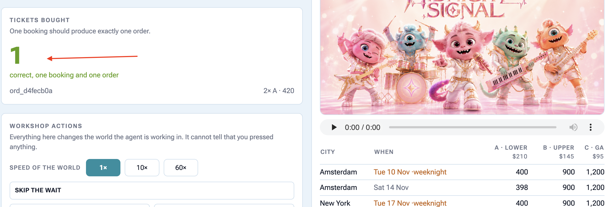


**The graph is fully green, and the edges are counted.** `brief` and `concert` have lit up — the two nodes that had never run. And the edges into `pick_show`,
`queue_up` and `check_front` now carry a badge:


**`2x` is the number of times the graph walked that edge, once per wake-up.** The 2 at the top are the price of resuming: the scheduler re-enters the graph from the beginning each time. It does *not* mean the work happened three times, and the venue panel is the proof: one queue ticket, not 2. `@node(rerun_on_resume=False)` is why.


### The graph

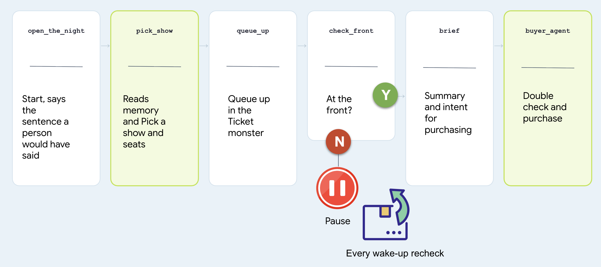

```python
# agent/concert/nightly.py
nightly = Workflow(
    name="concert_nightly",
    edges=[(START, open_the_night, pick_show, queue_up,
            check_front, brief, buyer_agent)],
)
```

**Note that two nodes are agents and two are functions, and treat which is which as the whole design question.**

| Node | Why that shape |
|---|---|
| `pick_show` | **agent.** Choosing a show from someone's history is judgement. It calls `recall`, reads the tour, and returns a validated `Plan` |
| `queue_up` | **function.** Joining a queue is a rule. A rule should not be a coin flip at 3am |
| `check_front` | **function.** "Am I at the front" has one right answer and the venue has it |
| `buy_it` | **agent.** It is `buyer_agent` — what `root_agent` used to be, unmodified. Section A sold out during the wait — take B, take C, or take nothing? That is the judgement you spent Module 4 teaching it |

Look at the last node and find the agent you built. Not a copy, not a rewrite:

```python
# agent/concert/nightly.py
from .agent import buyer_agent
```

All of it comes along: every tool it has, the seat-map re-read in `fence.py`, the
idempotency key in `purchase`. There is only one of it.

### Why it stopped instead of waiting

Here is the version nobody should write:

```python
# what NOT to write — this is nobody's file
while not ready:          # never do this
    time.sleep(1)
```

It keeps a process alive for forty minutes to achieve nothing, dies with the terminal, and cannot be resumed. Here is what `check_front` does instead:

```python
# agent/concert/nightly.py — check_front
if not status["ready"]:
    return RequestInput(message=f"Still at #{position}. Wake me and I'll check.")
```

`RequestInput` is an **interrupt**. The graph stops where it stands, the
invocation goes to the session store, and the process is free to exit.

<aside class="positive">
<b>👀 Developer's Note — an agent node cannot be first.</b> An agent responds to its input. Put one straight after <code>START</code> with no user message and it has nothing to respond to, and the run hangs with no error and no timeout. That is why the graph opens with <code>open_the_night</code>, a three-line function whose only job is to say the sentence a person would have said.
</aside>

<aside class="positive">
<b>⌨️ Reference Prompt</b> Turning a conversation into something that runs unattended:
<pre>Rewrite this flow as an ADK 2 Workflow graph, for a run with nobody watching.

Nodes, in order:
   open_the_night   function. Says the sentence a person would have said,
                    because an agent node cannot be first: it responds to its
                    input, and at START there is nothing to respond to
   pick_show        agent. Judgement, with an output_schema
   queue_up         function. Takes exactly one queue ticket
   check_front      function. Returns RequestInput when not ready
   brief            function. Writes the prompt for the last node
   buyer_agent      my existing agent, imported and unchanged

Rules:
  - steps that must be identical every time are function nodes; steps needing
    judgement are agent nodes
  - the wait is a node returning RequestInput, NOT a sleep loop. The run
    parks, the invocation is written to the session store, and the process
    may exit
  - put rerun_on_resume=False on anything with a side effect, especially
    queue_up. Every wake-up re-enters the graph from the start
  - do not rewrite my agent. Import it and make it the last node</pre>
<b>Check by hand:</b> <code>rerun_on_resume=False</code> on the queue node. Leave it off and every wake-up takes a fresh ticket, sending you back behind fourteen thousand people. The run gets further from finishing each time it resumes.
</aside>

> **The run costs nothing while it waits, and it ends in exactly one place:
> tickets bought. It just might take all night and several wake-ups to get
> there.**

---

## Working With a Human

### Don't Spend Money Without Double-Checking with a Person

An autonomous agent running overnight shouldn't make expensive financial choices based on guessed or ambiguous preferences from chat history.

Before executing high-stakes actions (like spending money on tickets), the agent must pause, ask the user to confirm their budget out loud, and save that explicit confirmation before making any purchases.


👉🔴 On the **venue panel**, press **RESET THE VENUE**. Every step starts from
the same world: 8 shows, all seats available, clock at 1×.

👉💻 Move to this step's code:

```bash
cd ~/monstertix
. ./set_env.sh
./use-solution.sh 9 --force
```

### Run it

👉💻 In **terminal 1**, Ctrl-C and restart. Same command as before:

```bash
cd ~/monstertix
. ./set_env.sh
adk web agent --port 8000 --allow_origins "*" \
  --session_service_uri="sqlite+aiosqlite:///$WORKSHOP/sessions.db" \
  --artifact_service_uri="file://$WORKSHOP/artifacts"
```

What changed since the last step:

| File | What changed |
|---|---|
| `budget.py` | Holds what the person agreed, as the sentence they said. `load()` reads it out of state, and `someone_is_there()` answers whether anybody is around to be asked |
| `tools.py` | added `set_budget`, so the agent can write an agreed limit into session state once a person has confirmed it |
| `nightly.py` | a new first node, `agree_budget`, which asks and reads back before anything else runs. It captures the budget **and** the rest of the ask, both as free text, and `SEATS` as a constant is gone |


### Don't model it. Store the sentence.

Open `agent/concert/budget.py` and read the whole thing:

```python
def load(state) -> str:
    """What they agreed, verbatim. Empty string means nobody has said."""
    return str(state.get("budget") or "")
```


```
state["budget"] = "up to $100 for the upper bowl or general admission, up to
                   $250 for the lower bowl, and up to $300 for a Saturday show"
```

The node checks two things... that **the person said it**, and that **they confirmed it**.

Then it keeps the sentence in session state rather than under `user:`, on purpose. A budget is agreed for one booking. "$250 if they're the good ones" was said about that band, on that night, and it has no business governing ticket booking.

### The same is true of everything else they said

Do not stop at the budget. People change their minds while they are deciding, so
capture everything they ask for here rather than relying on what the agent
happens to remember.

```
"I live in NYC, I can only do weekends, I have 10 people coming with me"
```

```python 
# agent/concert/nightly.py
def what_they_asked_for(ctx) -> str:
    """Everything this person typed, joined, in their own words."""
    said = []
    for event in (ctx.session.events or []):
        if event.author != "user":
            continue
        for part in (event.content.parts if event.content else []) or []:
            text = (getattr(part, "text", None) or "").strip()
            if text and text not in said:
                said.append(text)
    return "\n".join(said)
```

Read **Only events the user authored** it looks at **Only `text` parts** from the `function_response`, so the budget question and answer do not get echoed back in here. **No duplicates**.

Note `agree_budget` calls it on **every** run, not just the first, so a correction typed while the agent is queueing lands too. Then  `open_the_night` hand the picker both sentences, the ask and the budget, and the
picker read them.


### The graph, one node longer

Let's start this one with a conversation:

```python
# agent/concert/nightly.py
nightly = Workflow(
    name="concert_nightly",
    edges=[(START, agree_budget, open_the_night, pick_show, queue_up,
            check_front, brief, buyer_agent)],
)
```

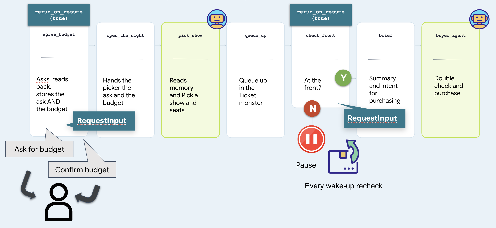

**Two nodes stop and wait, and they are the same mechanism.** `check_front` waits for a venue and is answered by a clock. `agree_budget` waits for a person and can only be answered by a person. That difference is the whole of step 10.

### Run it — step by step


#### 1. Start it

👉 Reload the **ADK web UI** and pick the `concert` agent.

👉✨ Ask for what you actually want:

```
Get us two tickets to the Amsterdam show.
```

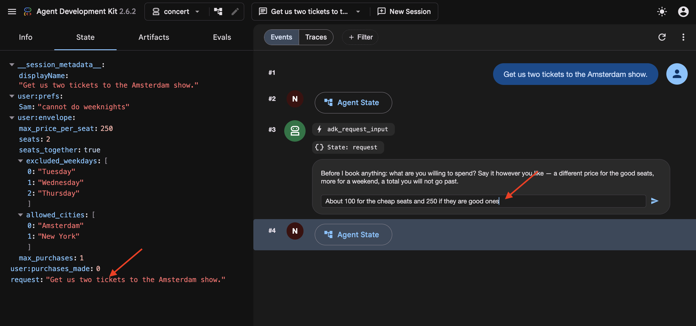

In step 8 the graph had no user, so whatever you typed was thrown away and `go` did as well as anything. Here `agree_budget` calls `what_they_asked_for(ctx)` on its very first line, which collects everything you have typed and puts it in `state["request"]`. Then `open_the_night` hands it to the picker alongside the budget.

You did not name a day, and Amsterdam has two shows. So watch the picker fall
back to `recall()` for that, find *"Sam bails on weeknights"*, and take the
Saturday.


And in the browser, the run **stops** on an `adk_request_input` event:

**A graph just asked you a question.** Same interrupt as the queue wait in step 8, but it now pointed at a person to answer the question.

#### 2. Answer the way people actually answer

👉✨ In the **`Enter your response...`** box — not the chat box at the bottom:

```
About a 100 for the cheap seats. 250 if they're the good ones.
```

Watch it stop and confirming:

```
[agree_budget] reading back: About a hundred for the cheap seats. Two-fifty
               if they're the good ones.

⚡ adk_request_input
   So: About a hundred for the cheap seats. Two-fifty if they're the good
   ones. Have I got that right?
```

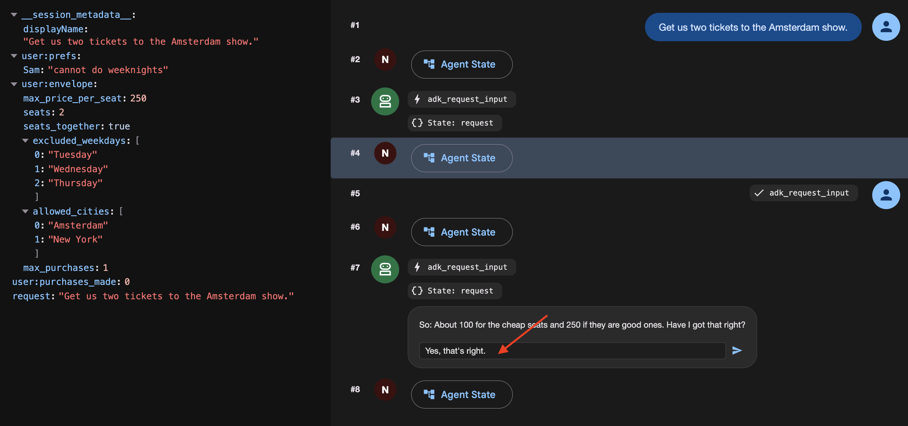

<aside class="negative">
<b>⚠️ Answer in the box on the event, not the chat box.</b> The chat box starts a new invocation, which runs the graph from the top and asks you the same question again. Everything below depends on getting this right.
</aside>

#### 3. Confirm it

👉✨ Same box:

```
Yes, that's right.
```

```
[agree_budget] agreed: About a hundred for the cheap seats. Two-fifty if
               they're the good ones.
[open]         Budget: About a hundred for the cheap seats. Two-fifty if
               they're the good ones.
[pick_show]    → {"section": "A", "reason": "..."}
[queue_up]     ms-ams-01 section A — ticket q_5924edc2 at #14,203
[check_front]  #14,203 — not yet. Pausing.
```

Four nodes ran off one word. 👉 Open the **State** tab and find **`budget`** — your sentence, verbatim.


**No prefix.** That is session state, and it is a decision worth making on purpose if you start a **New Session** and the budget will be gone, so it will asks you again.

<aside class="positive">
<b>👀 Developer's Note — the cost of that choice.</b> An unattended run gets a fresh session, so it has no budget agreed and falls back to the default in <code>nightly.py</code>. That is a limit that has to be re-agreed each time, against a limit that outlives the conversation it came from. 
</aside>

#### 4. Get to the front and finish

👉🔴 Press **SKIP THE WAIT** on the venue panel.


👉✨ Answer the newest `adk_request_input` — again in **its** box:

```
go
```

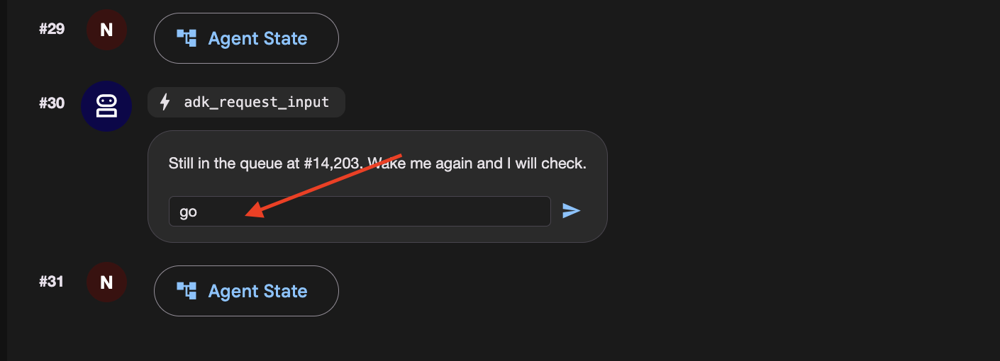

👉 Check the **venue panel**: one order, at a price inside what you agreed for that kind of seat.

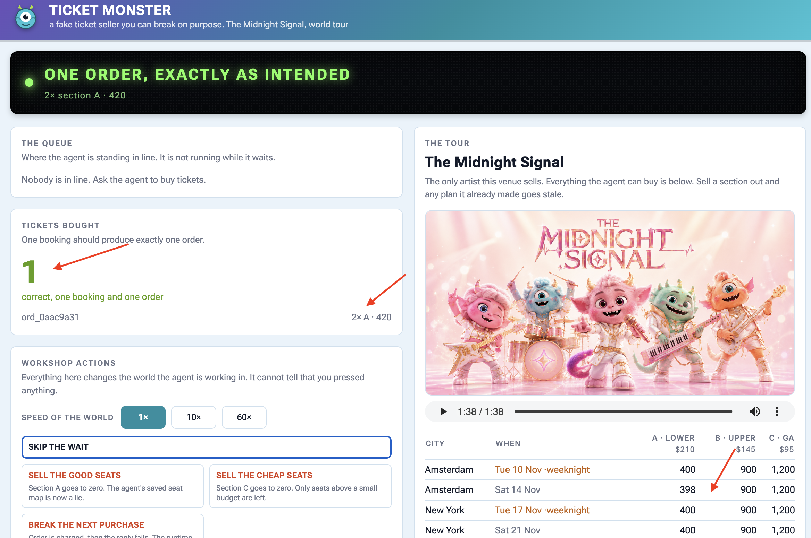

<aside class="negative">
<b>⚠️ Watch whether it respects the memory file too.</b> <code>memory/userx.md</code> says this person could not see a thing from the upper bowl at Ziggo Dome — so section B is a defensible price and a bad seat. Sometimes it takes B anyway. That is not a bug in the budget; it is the honest cost of leaving a decision to a model, and it is the most useful thing on the screen if it happens. Ask it why it chose that section.
</aside>

### How a graph asks a person a question

Open `nightly.py` and read `agree_budget`. Make three things true together, and
expect the same failure when any one is missing: it asks forever.

```python
@node(rerun_on_resume=True)              # 1. run again when woken
def agree_budget(node_input, ctx):
    answers = ctx.resume_inputs or {}    # 3. where the answer arrives

    said = answers.get(ASK_BUDGET)
    if not said:
        return RequestInput(
            interrupt_id=ASK_BUDGET,     # 2. STABLE id, not the default
            message="What are you willing to spend?",
        )
    ...
```

| | |
|---|---|
| `rerun_on_resume=True` | without it the node is treated as done and skipped |
| a **stable** `interrupt_id` | the default is a fresh UUID per run, so there is nothing to look the answer up by |
| `ctx.resume_inputs[id]` | where the answer lands. **Not** the return value of `RequestInput` — ADK iterates a node rather than sending into it |

<aside class="positive">
<b>👀 Developer's Note — this is the same primitive as the queue.</b> <code>check_front</code> returns a <code>RequestInput</code> because the venue is not ready. <code>agree_budget</code> returns one because a person has not answered. To the framework there is no difference: the run parks, costs nothing, and survives the process dying. One mechanism covers "waiting for the world" and "waiting for a human", which is most of what long-running means.
</aside>

### The graph


It is step 8's graph with one node in front. Nothing else moved.


<aside class="positive">
<b>⌨️ Reference Prompt</b> Putting a person inside an unattended graph:
<pre>Add a first node to my ADK 2 Workflow that agrees a spending limit with a
person before anything else runs.

It must:
  - ask what they are willing to spend, in their own words
  - read the answer back and wait for confirmation before storing it
  - treat a correction as the new answer, not as a refusal
  - store what they said as FREE TEXT in session state, never as a schema.
    "About a hundred for the cheap seats, two-fifty if they're good, and I'd
    go higher for a Saturday" is one decision with three numbers and two
    conditions in it, and every field you invent is a bet you lose in the
    first conversation
  - collect everything else the person typed the same way, and hand it to the
    picker alongside the budget

Three things must be true together, or it asks forever:
  @node(rerun_on_resume=True)          run again each time the graph is woken
  a STABLE interrupt_id                not the random default
  ctx.resume_inputs[interrupt_id]      where the answer actually arrives —
                                       NOT the return value of RequestInput

And it must know whether anybody is there to answer. Make that a property of
the REQUEST, not of the process: a browser has a person behind it, a
scheduler does not, and the same deployed service handles both.</pre>
<b>Check by hand:</b> the third of those three. ADK iterates a generator node rather than sending into it, so nothing comes back from <code>yield RequestInput</code>. Read the answer from <code>ctx.resume_inputs</code>, or watch it ask the same question for ever.
</aside>

> **The agreement came from the person, they confirmed it out loud, and it dies
> with the conversation it was agreed in. A limit that outlives the reason for
> it is not a limit any more — it is a default nobody remembers choosing.**

---

## The Cloud Stack

### Laptops Sleep and Local Files Disappear

On your laptop, an agent depends on your computer staying awake, local SQLite databases, and local files. If you close your laptop lid or deploy to a cloud container that restarts, local files and memory disappear.

To run reliably in production:
1. **Cloud Compute**: Run the agent in a container (like Cloud Run) that stays online.
2. **Durable Cloud Databases**: Replace local files and SQLite with cloud services (Cloud SQL for session data, Cloud Storage for files).
3. **Cloud Timers**: Use managed schedulers (like Cloud Scheduler and Pub/Sub) so the agent wakes up even when your laptop is turned off.

👉🔴 On the **venue panel**, press **RESET THE VENUE**. Every step starts from
the same world: 8 shows, all seats available, clock at 1×.

👉💻 Move to the final code:

```bash
cd ~/monstertix
. ./set_env.sh
./use-solution.sh 10 --force
```

| File | What changed |
|---|---|
| `main.py` | new. One FastAPI serving the chat page **and** the endpoint a scheduler calls |
| `Dockerfile` | new. Ordinary python-slim and uvicorn. Nothing about it is ADK-specific |
| `monstertix/` | copied in, so the page ships in the same container as the agent |
| `concert/` | **unchanged.** Byte-for-byte the folder you finished step 9 with |

<aside class="positive">
<b>👀 Developer's Note — nothing about the agent changes to deploy it.</b> Copy <code>concert/</code> from step 9 into step 10 and diff it: the files are identical. Everything in this step is a new entrypoint, a container, and configuration. That is the result worth having — an agent that needed rewriting to be deployed would mean the earlier steps taught you the wrong shape.
</aside>

### The page you already built

Go back to the chat page from step 3. It has been sitting there since, waiting
for this step.

The **ADK web UI** is a developer tool. The State tab, the event stream and the graph are
what you want while you are learning, and none of it is something you hand to
another person. It does not exist on Cloud Run either.

The page does exactly what `adk web` did for you: talks to the agent, shows what
it said, lets you answer when it asks something. What it does not do is expose
your development tools to whoever has the URL.


### Three files that cannot come with you

Stop the server and look at what it wrote:

```
sessions.db          a SQLite file next to the code
memory/userx.md      a markdown file you can open in an editor
artifacts/           seat maps written to a folder
```

**Keep all three for learning.** Open them, read them, edit the memory file and
watch the next answer change. Do not wish them into a database; nothing about a
workshop would be better for it.

Now expect all three to stop working the moment you deploy, and understand
exactly why rather than taking it on faith.

A Cloud Run container has a writable filesystem, so nothing errors when the agent
writes to it. But that filesystem belongs to **one instance**, and Cloud Run
starts and stops instances as traffic comes and goes. When yours stops, the disk
goes with it. Two more instances may be running beside it, each with its own copy
of a file it thinks is the only one.

So picture an agent joining a queue at 3am, writing the ticket to `sessions.db`,
and finding the file empty when something wakes it, or finding a different file
on a different instance. Look for an error or a crash and find neither. Just an
agent that has forgotten.

**What you need instead is state that outlives any one container.** Three
services, one for each file:

| On your laptop | In the cloud | What it is |
|---|---|---|
| `sessions.db` | **Cloud SQL** | a managed Postgres database. It exists whether or not anything is running |
| `memory/userx.md` | **Cloud Storage** | a bucket. Files as objects, reachable from every instance at once |
| `artifacts/` | **Cloud Storage** | the same bucket |
| `clock.py` | **Cloud Scheduler** | a cron that Google runs. Your terminal is not an alarm clock |

If those are new to you, read Cloud SQL as a database you do not run yourself,
Cloud Storage as a folder that lives on the internet, and Cloud Scheduler as a
cron job with retries and a timezone that keeps working when your laptop is shut.

### Create them

Provision a PostgreSQL database, database user, and Cloud Storage bucket. Note that Cloud SQL instance creation takes several minutes and was initiated in the background during `setup.sh`.

👉💻 Collect it, and make the rest:

```bash
cd ~/monstertix
./setup-cloud-state.sh
```

```
→ instance  RUNNABLE
→ database  adk created
→ user      adk created
→ bucket    created
→ memory    memory/userx.md → gs://your-project-agent-you/memory/
✓ durable state ready. Written to .env
```

<aside class="positive">
<b>👀 Developer's Note — or ask for it instead.</b> If you have the <b>Google Cloud MCP server</b> connected to your coding assistant, you can describe what you want rather than run a script. Something like:
<br><br>
<i>"In project <code>&lt;my-project&gt;</code>, region <code>us-central1</code>: create a Cloud SQL Postgres instance called <code>workshop-sessions</code> on <code>db-f1-micro</code>, a database <code>adk</code> and a user <code>adk</code> on it, and a Cloud Storage bucket named after the project with uniform access. Then give me the connection name and a <code>postgresql+asyncpg://</code> URI that uses the Cloud Run unix socket."</i>
<br><br>
Read what it proposes before you approve it. The script exists so the workshop is reproducible; the prompt exists because this is how you will actually do it at work.
</aside>

That script created four things, one per row of the table above, and wrote two
URIs into `.env`:

```
CLOUD_SESSION_SERVICE_URI=postgresql+asyncpg://adk:…@/adk?host=/cloudsql/proj:region:instance
CLOUD_ARTIFACT_SERVICE_URI=gs://your-project-agent-you/artifacts
```

**Look at what those replaced.** `sqlite+aiosqlite:///…/sessions.db` became a
Postgres URI, and `file://…/artifacts` became `gs://…`. Recognise the same two
flags you have typed after `adk web` since step 4, and note that only the scheme
changed.

<aside class="positive">
<b>👀 Developer's Note — <code>postgresql+asyncpg://</code>, not <code>postgresql://</code>.</b> ADK drives SQLAlchemy through its asyncio extension, so the driver has to be an async one and <code>asyncpg</code> has to be installed. Same trap as <code>aiosqlite</code> in step 6, and it fails the same way: fine until the first session write, which in the cloud is at 3am with nobody watching. The <code>host=/cloudsql/…</code> is a unix socket Cloud Run mounts for you, which is why the host looks like a path.
</aside>

### Now deploy, and give it an alarm clock

With the services ready, give the agent its permanent home.

👉💻 Three or four minutes. Start it and read on:

```bash
cd ~/monstertix
. ./set_env.sh
./deploy-agent.sh
```

That builds `agent/` into a container, pushes it to Cloud Run, and then wires up
three more things. Know what each is for, because "deploy the agent" is only the
first of five steps:

```
1. gcloud run deploy       the container: your agent, the graph, and the page
2. a Pub/Sub topic         a queue for messages
3. a service account       an identity, so the message is allowed in
4. a push subscription     topic ──► /trigger/wake
5. a Cloud Scheduler job   the alarm clock, on a cron
```

<aside class="negative">
<b>⚠️ Why use <code>/trigger/wake</code> instead of ADK's built-in <code>/apps/&lt;app&gt;/trigger/pubsub</code>?</b><br>
ADK's default trigger creates a brand-new <code>session_id</code> and <code>user_id</code> for every incoming message:
<pre>session_id = str(uuid.uuid4())
user_id    = subscription.replace("/", "--")</pre>
This works for stateless, one-off tasks. But for long-running workflows, a new session lacks existing context (queue tickets, budget, history) and would trigger a duplicate purchase instead of resuming the pending run.
<br><br>
<code>/trigger/wake</code> finds the user's existing parked session and resumes it.
</aside>

**Why a scheduler.** Go back to `clock.py` in step 3: sleep, then POST. It
worked, and it dies with your terminal. Cloud Scheduler is the same idea run by
Google: it fires on a cron, retries if the call fails, understands timezones, and
does not care whether your laptop is open. It is the trigger you already built,
living somewhere permanent.

**Why Pub/Sub in the middle.** Cloud Scheduler could call your service directly,
so the topic looks like an extra step. It buys you three things:

```
   Cloud Scheduler ──► Pub/Sub topic ──► push subscription ──► your agent
     fires on a cron    holds the           delivers, and       runs
                        message             retries if the
                                            agent is down
```

**It holds the message.** Let the agent be deploying, restarting, or briefly
broken at 3am, and expect the message to wait instead of vanish. **It retries**,
so write no retry logic. And **it fans out**: subscribe a second thing that cares
about presales to the same topic tomorrow, without touching the scheduler.

That is why ADK gives you a trigger endpoint rather than expecting you to write
one. `trigger_sources=["pubsub"]` mounts a route that speaks Pub/Sub's push
format, so the message arrives as an invocation.

```
→ agent    https://concert-you-xxxx.run.app
→ topic    presale-you created
→ iam      concert-trigger@your-project… may invoke concert-you
→ push     → https://concert-you-xxxx.run.app/trigger/wake
→ schedule 0 3 * * *
```

<aside class="positive">
<b>👀 Developer's Note — asking for this instead.</b> With the Google Cloud MCP server connected, the five steps above are one request:
<br><br>
<i>"Deploy the folder <code>agent/</code> to Cloud Run in project <code>&lt;my-project&gt;</code> as <code>concert-me</code>, unauthenticated, with these environment variables: … Then create a Pub/Sub topic <code>presale-me</code>, a service account that may invoke the service, a push subscription from the topic to <code>&lt;service-url&gt;/trigger/wake</code>, and a Cloud Scheduler job firing the topic at 03:00 UTC daily."</i>
<br><br>
Read the plan before approving. The point of naming all five resources is that you can tell when one is missing.
</aside>

<aside class="negative">
<b>⚠️ Trigger endpoints need Cloud Run or GKE.</b> Agent Runtime does not support scheduled or event-driven triggers, so this is not a choice between deployment targets.
</aside>

### Talk to it

👉 Open the agent's URL in a browser. Not the venue panel, not the **ADK web UI** — the service
you just deployed. This is MonsterTix, on the internet, with nothing of your
laptop involved.

It knows nothing about you. The memory file went into the bucket, but this is a
fresh session with no conversation in it.

👉✨ Ask it to book:

```
Book me two tickets for The Midnight Signal. Best seats in the house,
I don't want the cheap ones.
```

**Watch it ask what you are willing to spend**, exactly as it did on your laptop,
and read the number back before committing to it.

👉✨ Answer the way you would out loud, then confirm:

```
up to 250 a seat for the good ones
```

Stop on the fact that it asks at all, because the obvious implementation of
"don't ask at 3am" breaks it.

Give `agree_budget` a way to know whether anybody is there to answer. Reach for
an environment variable, set `UNATTENDED=1` on the deploy, and skip the question.
Now look at the shape of what you just built:

```
  ONE deployed service, TWO kinds of caller

  your browser  ──► /wake                        somebody is plainly here
  Cloud Sched.  ──► /trigger/wake                nobody is
```

Notice both arrive at the same process. Ask a variable read once at boot to tell
them apart and it cannot, so setting it silences the question for the browser
too. Now you have an agent that spends a number you never agreed to, which is the
one thing the whole of Module 5 exists to prevent.

**"Is a person here?" is a fact about a request, not about a process.** So the
variable is only the *default*, unattended, the safe assumption for anything a
scheduler can reach, and the `/wake` route, which only ever runs because somebody
typed, overrides it for the length of that one request:

```python
# concert/budget.py
_attended = contextvars.ContextVar("attended", default=None)

def mark_attended(value=True):     # called by /wake, never by the trigger
    _attended.set(value)

def someone_is_there():
    marked = _attended.get()
    return marked if marked is not None else not _UNATTENDED_BY_DEFAULT
```

Note a `ContextVar` is scoped to the asyncio task, which in FastAPI is exactly
one request. Two callers, one process, different answers:

| Caller | `someone_is_there()` | What happens |
|---|---|---|
| `adk web` on your laptop | `True` | asks, and confirms |
| MonsterTix `/wake`, deployed | `True` | asks, and confirms |
| Pub/Sub at 3am | `False` | runs on the standing budget, never stops |

👉🔴 Open your venue panel and press **SKIP THE WAIT**, then tell the agent it is
at the front:

```
You're at the front of the queue now.
```

👉 Watch the panel while it buys. One order, in a database on the other side of
the world, placed by a container you never logged into.

### Fire it the way 3am will

The run is parked in the queue right now, which is exactly the state 3am finds it
in. So be 3am.

👉🔴 Press **SKIP THE WAIT** on the venue panel, so the queue is ready when the
message arrives.

👉💻 Publish to the topic, which is precisely what Cloud Scheduler does:

```bash
gcloud pubsub topics publish presale-$(gcloud config get-value account | cut -d@ -f1) \
  --message='The presale just opened.'
```

👉 **Now watch the browser, and do not touch it.** Within a few seconds the
agent's reply appears on its own: it bought the tickets, at a price inside what
you agreed, and told you so.

Nobody typed. Scheduler published, Pub/Sub delivered, your endpoint found the
session that was waiting, and the run finished.

👉🔴 Check the venue panel. **One order, not two.**

<aside class="positive">
<b>👀 Developer's Note — why the page noticed.</b> A scheduled run finishes on the server, and nothing about that reaches an open browser on its own. So MonsterTix polls <code>/session/&lt;id&gt;/messages?since=&lt;timestamp&gt;</code> every four seconds and prints whatever is new. Unglamorous, and it survives the tab being closed overnight and reopened in the morning — which is the actual use case, and something a websocket would not have survived.
</aside>

<aside class="negative">
<b>⚠️ If it books a second pair of tickets, check where your subscription is pushing.</b>
<pre>gcloud pubsub subscriptions describe &lt;topic&gt;-push \
  --format='value(pushConfig.pushEndpoint)'</pre>
It must end in <code>/trigger/wake</code>. If it ends in <code>/apps/concert/trigger/pubsub</code> you are on ADK's built-in trigger, which starts a brand new session every fire — so it does not resume your booking, it starts another one. <code>deploy-agent.sh</code> updates an existing subscription, but a subscription created by hand earlier will keep whatever endpoint it was born with.
</aside>

**To run it on a real schedule**, the job has to be enabled — `jobs run` refuses on
a paused one with `Job.state must be ENABLED`:

```bash
gcloud scheduler jobs resume presale-$(gcloud config get-value account | cut -d@ -f1) \
  --location=$GOOGLE_CLOUD_REGION
```

And for a demo, make it impatient:

```bash
gcloud scheduler jobs update pubsub presale-$(gcloud config get-value account | cut -d@ -f1) \
  --location=$GOOGLE_CLOUD_REGION --schedule="*/5 * * * *"
```

<aside class="negative">
<b>⚠️ Pause it again when you are done.</b> An enabled job fires against your venue every night, or every five minutes if you set the impatient schedule above. <code>gcloud scheduler jobs pause &lt;job&gt; --location=$GOOGLE_CLOUD_REGION</code>.
</aside>

### Check the state is really durable

Do this part. It is the claim the whole step rests on.

👉💻 Your 3am run, as rows in a database that is not on your laptop:

```bash
gcloud sql connect workshop-sessions --user=adk --database=adk
```

```sql
select id, app_name, user_id from sessions;
select count(*) from events;
```

👉💻 And the memory file, as an object in a bucket:

```bash
gcloud storage cat gs://your-project-agent-you/memory/userx.md | head -20
```

👉 In the Cloud Console, open **Trace**. The run appears as one trace with the
queue wait as a gap in the middle: the agent doing nothing, for exactly as long
as it was supposed to do nothing. `deploy-agent.sh` passed `--trace_to_cloud`,
which is the only reason there is anything to look at.

<aside class="negative">
<b>⚠️ The interrupt that makes step 9 work will hang this one.</b> <code>agree_budget</code> stops the run and asks what you will spend. In front of a browser that is right. At 3am it is fatal: Pub/Sub delivers a message, the graph stops on a question, and nobody types an answer — so nothing is bought and nothing looks broken. That is what <code>someone_is_there()</code> is for: this run has no person behind it, so <code>agree_budget</code> takes the standing budget instead of stopping. <b>Anything that can stop and ask a person needs a way to know whether a person is there — per request, not per process.</b> The queue pause is different and fine — the next scheduled fire answers that one. A clock can answer a clock; only a person can answer a question.
</aside>

<aside class="positive">
<b>👀 Developer's Note — why Pub/Sub caps at ten minutes.</b> A push subscription gives your endpoint a limited window to acknowledge. That is exactly why <code>join_queue</code> returns immediately instead of blocking for forty minutes, and why <code>check_front</code> parks rather than waits. The work has to outlive the request that started it. Every decision in Module 4 was paying for this moment.
</aside>

### Clean up

Count two things deployed: the venue, and the agent beside it. Both scale to
zero, so an idle one costs nothing. Delete them anyway.

```bash
./destroy-agent.sh          # service, topic, subscription, scheduler job
./destroy-venue.sh
```

Notice those deliberately leave Cloud SQL and the bucket alone, because they hold
your data and **both keep billing**. When you are certain you are finished:

```bash
./destroy-agent.sh --all
```

Everything else is local. Delete the folder when you are done, or keep it and run
it against your own project for as long as you like.

> **The agent, its tools, its callbacks and the budget did not change. Two URIs
> and one environment variable did.**

---

## What you built, and what to do when it breaks

### The diff between your laptop and production

| Your laptop | In the cloud | What changed |
|---|---|---|
| `--session_service_uri=sqlite+aiosqlite:///…` | Cloud SQL | a connection string |
| `--artifact_service_uri=file://…` | `gs://bucket` | a URI |
| `memory/userx.md` | `gs://bucket/memory/` | a path |
| `adk web` | one Cloud Run service | a `Dockerfile` and a `main.py` |
| `monstertix/clock.py` | Cloud Scheduler → Pub/Sub | `trigger_sources=["pubsub"]` |
| you, at the keyboard | `someone_is_there()` | a default, overridden per request |

**Check your `root_agent`, its tools, its callbacks and the budget, and find them
unchanged.** Diff `solutions/step10_deploy/concert/` against the folder you
finished step 9 with and see it byte for byte. That is the argument for ADK's
service abstraction, and it is the last thing worth remembering.


### Building your own

Forget the concert tickets and keep the shape: **a task that takes longer than a
conversation, against a system you do not control.** Look for it in restocking,
claims, renewals, migrations, anything with a queue.

Start your own from the prompt below. Fill in the four bracketed parts and give
it to your coding assistant:

```
I want to build a long-running agent with Google ADK 2 on Google Cloud.

The job: [what it does, e.g. "watch for a supplier to restock part X
and place an order the moment it appears"]

The waiting: [what it waits for, and how long, e.g. "restock can take
hours; the API returns a job id immediately and I poll it"]

The limits: [what it must never do unattended, e.g. "never spend over
an agreed amount; never order from a supplier not on my list"]

The wake-up: [what tells it to check again, e.g. "a cron every 15 min"]

Build it in this shape:
  - the slow call is a LongRunningFunctionTool so the run parks instead
    of blocking, with ResumabilityConfig on the App
  - a Workflow graph: functions for the steps that must be identical
    every time, agent nodes for the ones needing judgement
  - the wait is a node returning RequestInput, not a sleep loop, with
    rerun_on_resume=False on anything with a side effect
  - the limits are agreed with a person, confirmed back to them, and
    stored in state the conversation cannot reach
  - whether a person is there is a fact about the REQUEST, not the
    process: the chat route says so, the scheduler route does not
  - re-read anything time-sensitive in a before_tool_callback right
    before acting, and send an idempotency key on anything that spends
  - sessions in Cloud SQL, memory and artifacts in Cloud Storage
  - one Cloud Run service serving both a chat page and
    trigger_sources=["pubsub"], woken by Cloud Scheduler

Start with the smallest version that parks and resumes. Add the limits
after that works.
```

Pay attention to the last line above all. Everything in this workshop was easy
once the run could stop and start again, and impossible before.

### If you got stuck

Reach for the complete working code at any step:

```bash
./use-solution.sh N --force          # any step. resets memory + sessions + artifacts
./use-solution.sh N --force --keep   # code only, leave state alone
```

### When something breaks


| Symptom | Fix |
|---|---|
| `✗ Cannot access project` | Wrong id. `rm ~/project_id.txt && ./setup.sh` |
| Model returns 404 | `-latest` aliases are AI Studio only. Use `ADK_MODEL=gemini-latest-flash` |
| `address already in use` | Something already has port 8000 or 8090. `lsof -ti:8000 \| xargs kill -9` |
| Agent can't reach the venue | `curl $VENUE_URL/health`, or `./deploy-venue.sh` again |
| Queue never advances | Press **SKIP THE WAIT**. At 1× the queue will not reach the front on its own |
| A second queue ticket appears on the panel | You answered in the chat box instead of the `Enter your response...` box on the `adk_request_input` event. The chat box starts a new run |
| Dropdown is empty, or the app will not load | `adk web` treats every folder under `agent/` as an app and fails the whole list if one is not. `ls agent/` should show `concert/` and nothing else — running things from inside `agent/` can leave a stray `memory/` behind. `./use-solution.sh 8 --force` tidies it |
| `[EXPERIMENTAL]` warnings | Expected. `EventsCompactionConfig` and `ResumabilityConfig` are both pre-GA in 2.6.2 |
| Everything is strange | Press **RESET THE VENUE**, then `rm sessions.db` |
| Memory file full of duplicate bookings | `remember()` appends every run. `./use-solution.sh N --force` resets it, or `cp seed/memory/default.md memory/userx.md` |
| `adk: command not found` | `source .venv/bin/activate` — every new tab needs it |
| Cloud Shell timed out | Start `adk web` again. `sessions.db` survived — which is step 6, happening to you for free |
